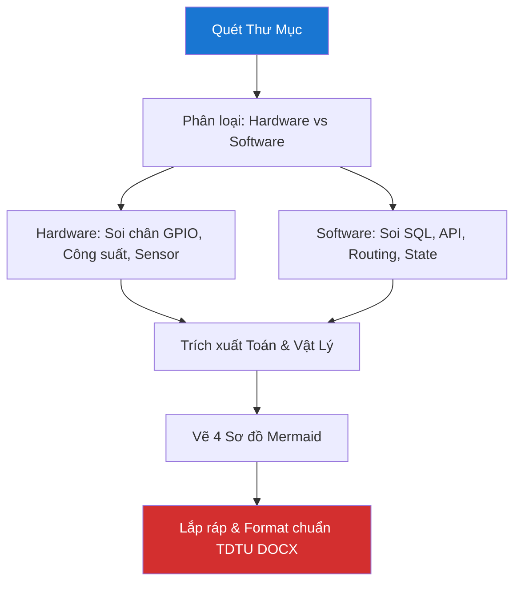

# 🔬 Deep Research & Thesis Generator Skill — v1.0 Pro

> **Version:** 1.0 Pro · **Updated:** 2026-04-20 · **Category:** Deep Analysis & Documentation  
> **Tính năng:** Quét 100% source code, trích xuất cấu trúc phần cứng/phần mềm, phát sinh phương trình toán/vật lý, tự động vẽ 4 sơ đồ (Mermaid), và sinh format DOCX chuẩn TDTU MauDATN_2021.

---

## 1. Mục tiêu (Objective)
Đóng vai trò là **Nghiên cứu sinh & Chuyên gia Báo cáo luận văn**. 
Phân tích *chiều sâu* toàn bộ dự án thay vì chỉ đọc qua loa. Hiểu tường tận từ mạch điện, linh kiện, công suất đến thuật toán phần mềm. Cuối cùng đóng gói mớ kiến thức đó thành một file Báo Cáo / Luận Văn cực kỳ bài bản theo đúng quy chuẩn format để thầy giáo chấm điểm "A+".

**Triết lý cốt lõi:** *"Không chỉ báo cáo cái gì đã làm, mà phải chứng minh hiểu sâu TẠI SAO lại làm như vậy."*

---

## 2. Trigger — Khi nào kích hoạt

| Lời nói của User | Ngữ cảnh | Priority |
|---|---|---|
| *"viết cho tôi bài báo cáo chi tiết cho thầy xem"* | Chuẩn bị nộp đồ án/môn học | 🔴 Cao |
| *"mổ xẻ dự án này ra, tao đã học được gì"* | Rút kinh nghiệm dự án | 🔴 Cao |
| *"làm file docx gồm 4-5 sơ đồ"* | Cần file nộp ngay | 🔴 Cao |
| *"viết luận văn chuẩn format TDTU"* | Viết Thesis cấp Đại học | 🔴 Cao |

> ⚠️ **Lưu ý khác biệt với `skill_viet_docs.md`:** 
> Nếu user chỉ cần "viết README.md" hoặc "thêm chú thích code", hãy dùng `skill_viet_docs`. Nếu user cần nộp **file Word cho Giáo viên**, hãy dùng skill này!

---

## 3. Deep Research Pipeline (Quy trình Quét Sâu Dự Án)

Để hiểu được dự án, AI PHẢI MỞ VÀ ĐỌC HẾT CÁC FILE QUAN TRỌNG, không được lướt qua.



### Bước 1: Scan Source Code & BOM
- Liệt kê toàn bộ file và thư mục. Đọc nốt nội dung các file core (main.cpp, App.jsx, schema.sql, requirements.txt).
- Liệt kê BOM (Bill of Materials): Các linh kiện đã xài trên file schematic / logic.

### Bước 2: Tự Động Định Hình 4 Sơ Đồ Cốt Lõi
Dựa trên code quét được, sinh ra 4 sơ đồ Mermaid bắt buộc phải có cho báo cáo:
1. **Sơ đồ khối hệ thống (Block Diagram):** Box-to-box nối liền hardware và cloud.
2. **Sơ đồ mạch logic / Sơ đồ kết nối:** Mapping các chân MCU (12, 14, 15...).
3. **Sơ đồ hoạt động (Flowchart):** User nhấn nút -> Hệ thống làm gì.
4. **Sơ đồ trình tự (Sequence Diagram):** Client gọi API -> DB trả data -> Update UI.

### Bước 3: Đào bới Công thức (Toán, Lý, Điện)
Thầy giáo rất thích nhìn thấy Toán. AI phải tự suy luận ra từ code:
- *Ví dụ Code có Delay xoay Servo:* Suy ra phương trình T (chu kỳ) của xung PWM 50Hz, tính góc quay $\alpha = f(t_{high})$.
- *Ví dụ Code có trở kéo (Pull-up):* Dẫn chứng tại sao $R = 10k\Omega$, công thức dòng chảy $I = V/R$ bảo vệ chống nhiễu loạn.
- *Ví dụ Code Motor:* Đưa công suất $P=U \times I$ để giải thích tại sao phải dùng Module L298N thay vì nối thẳng vô Arduino.

---

## 4. Format Chuẩn DOCX Luận Văn TDTU

Khi xuất văn bản, yêu cầu AI cung cấp Template hoặc hướng dẫn tạo file với quy chuẩn sau (dựa trên **MauDATN_2021 TDTU**).

### 4.1 Quy tắc Trình bày Layout (Áp dụng nếu render qua python-docx)
Dựa theo chuẩn `MauDATN_2021`:
- **Cỡ chữ:** 13pt (Toàn bài). Font: **Times New Roman**.
- **Giãn dòng:** 1.5 lines.
- **Lề (Margins):** Trên: 3.5cm, Dưới: 3.0cm, Trái: 3.5cm, Phải: 2.0cm.
- **Căn lề (Alignment):** Justify (Canh đều 2 bên).
- **Đánh số trang:** Ở giữa (Center), lề trên hoặc lề dưới.
- **Danh mục từ viết tắt:** Luôn để đầu trang nếu có quá nhiều từ viết tắt.

### 4.2 Quy tắc Đánh Heading
- **Chương:** `CHƯƠNG 1: TỔNG QUAN` (IN HOA, Bold, 14pt, Căn giữa).
- **Mục Cấp 1:** `1.1. Mục tiêu đề tài` (Bold, 13pt).
- **Mục Cấp 2:** `1.1.1. Mục tiêu cụ thể` (Bold, nghiêng, 13pt).

### 4.3 Quy tắc Hình ảnh & Bảng biểu
- Luôn để placeholder ảnh kèm chú thích chuẩn TDTU:
- *Ví dụ Ảnh:* Chèn `<Kẻ khung chứa ảnh ở đây>` ➔ Chú thích bên dưới: `Hình 1.1: Sơ đồ khối hệ thống` (In nghiêng, 12pt, Căn giữa).
- *Ví dụ Bảng:* Chú thích nằm BÊN TRÊN bảng: `Bảng 2.1: Danh sách linh kiện` (In nghiêng, 12pt, Căn ngang).

---

## 5. Mẫu Nội Dung Báo Cáo (6 Chương Chi Tiết - 7 Phần)

Nội dung AI sinh ra phải tuân thủ khung sườn siêu chi tiết này, đổ kiến thức tự quét được vào các lỗ hổng. **BẮT BUỘC PHẢI DUY TRÌ ĐÚNG 6 CHƯƠNG VÀ ĐỦ 7 TIỂU MỤC (X.1 -> X.7) TRONG KẾT QUẢ.**

```markdown
# [TÊN ĐỀ TÀI DỰ ÁN]
**Họ và tên SV:** [Tên] | **MSSV:** [Mã số]

## CHƯƠNG 1: TỔNG QUAN
### 1.1 Khái quát về đề tài (Hiện trạng thực tế, lý do chọn đề tài)
### 1.2 Mục tiêu nghiên cứu (Nêu rõ phần cứng và phần mềm)
### 1.3 Phạm vi và Đối tượng (Giới hạn thuật toán, board mạch, web app)
### 1.4 Ý nghĩa thực tiễn của giải pháp
### 1.5 Phương pháp nghiên cứu và cách thức tiếp cận
### 1.6 Bố cục của luận văn / báo cáo
### 1.7 Sơ đồ tư duy tổng quát đề tài (Chèn `<Ảnh Sơ đồ tư duy / Mindmap>` hoặc Mermaid)

## CHƯƠNG 2: CƠ SỞ LÝ THUYẾT & KỸ THUẬT CÔNG NGHỆ
### 2.1 Các giao thức truyền thông (WebSockets, MQTT, HTTP, I2C...)
### 2.2 Các linh kiện phần cứng (MCU, Sensor, Driver)
*(Mẫu ảnh: `<Chèn ảnh thực tế của Linh Kiện / Board Mạch>`)*
### 2.3 Công nghệ Web App và Phần Mềm (React, NodeJS, Electron...)
### 2.4 Cơ sở toán học và Động lực học (Kinematics, Phương trình điện P=UI)
### 2.5 Kiến trúc xử lý đa luồng / Web Workers / Đám mây
### 2.6 Đánh giá ưu nhược điểm của các nền tảng lý thuyết
### 2.7 Sơ đồ khối các nền tảng liên kết [Chèn Mermaid Block Diagram]

## CHƯƠNG 3: THIẾT KẾ CẤU TRÚC VÀ TÍCH HỢP PHẦN CỨNG
### 3.1 Sơ đồ khối tổng thể phần cứng [Chèn Mermaid Diagram Sơ đồ khối]
### 3.2 Thiết kế sơ đồ nguyên lý (Schematics)
### 3.3 Thiết kế sơ đồ mạch in (PCB Layout)
### 3.4 Sơ đồ nối dây chi tiết và cấp nguồn (Pin mapping / GPIO)
### 3.5 Bảng danh sách lựa chọn linh kiện và Board mạch
*(Mẫu ảnh: `<Chèn ảnh Board mạch hàn / Các Module cắm dây thực tế>`)*
### 3.6 Tính toán công suất và Lựa chọn pin / Nguồn điện 
### 3.7 Quy trình chuẩn bị lắp ráp và khung sườn cơ khí
*(Mẫu ảnh: `<Chèn ảnh quá trình lắp ráp vỏ Mica/Nhựa 3D>`)*

## CHƯƠNG 4: THIẾT KẾ PHẦN MỀM VÀ GIẢI THUẬT ĐIỀU KHIỂN
### 4.1 Sơ đồ DB ERD, State Management [Chèn Mermaid ERD]
### 4.2 Thiết kế lưu đồ thuật toán MCU [Chèn Mermaid Flowchart Firmware]
### 4.3 Thiết kế luồng chạy Frontend Web/App [Chèn Mermaid Flowchart Web App]
### 4.4 Thuật toán tối ưu điều khiển (PID, State Machine, Filters)
### 4.5 Tương tác API phần cứng ↔ phần mềm [Chèn Mermaid Sequence Diagram]
### 4.6 Thiết kế giao diện Dashboard / Mobile App
*(Mẫu ảnh: `<Chèn các ảnh chụp màn hình UI App / Web App>`)*
### 4.7 Mô tả chi tiết logic 5 chức năng cốt lõi trên Web App
*(Kèm Snippet logic quan trọng của React / Electron)*

## CHƯƠNG 5: THỰC NGHIỆM VÀ ĐÁNH GIÁ KẾT QUẢ TỔNG THỂ
### 5.1 Quy trình thực nghiệm hệ thống
### 5.2 Kết quả thi công thành phẩm phần cứng
*(Mẫu ảnh: `<Chèn ảnh chụp Toàn Cảnh Robot/Thiết bị đã hoàn thiện>`)*
### 5.3 Kết quả kiểm thử tính năng Web App và điều khiển
*(Mẫu ảnh: `<Chèn ảnh test thực tế đang bấm nút trên App và thiết bị chạy>`)*
### 5.4 Đánh giá độ trễ và tốc độ phản hồi (Real-time Latency đo trên Terminal)
### 5.5 Đối chiếu kết quả với Mục tiêu ở Chương 1
### 5.6 Thống kê các lỗi kỹ thuật trong quá trình làm và cách khắc phục
### 5.7 Đánh giá độ ổn định của toàn bộ giải pháp

## CHƯƠNG 6: KẾT LUẬN & HƯỚNG PHÁT TRIỂN
### 6.1 Tổng kết kết quả nghiên cứu
### 6.2 Đóng góp nổi bật của đề tài đối với thực tiễn
### 6.3 Hạn chế và điểm mù của hệ thống hiện tại
### 6.4 Hướng phát triển phần cứng tương lai (Nâng cấp chip, thu nhỏ mạch)
### 6.5 Hướng mở rộng Web App và Cloud (Tích hợp AI, Microservices)
### 6.6 Bài học kinh nghiệm đúc kết từ sinh viên
### 6.7 Lời cảm ơn và Lời ngỏ
```

---

## 6. Trình Tạo DOCX Bằng Python (DOCX Generator)
Vì AI không xuất được file DOCX trực tiếp từ khung chat, hãy đưa cho user đoạn Code Python này. Đoạn code này dùng `python-docx` để tạo báo cáo **TUYỆT ĐỐI CHUẨN FORMAT TDTU**. User chỉ cần chạy script. Có thể xuất HTML báo cáo markdown ra Word.

```python
# Tự động chèn Python snippet này cung cấp cho user khi họ đòi file "docx" thật sự.
from docx import Document
from docx.shared import Pt, Cm, Inches
from docx.enum.text import WD_ALIGN_PARAGRAPH
from docx.oxml.ns import qn

def tao_bao_cao_tdtu(file_name="Bao_Cao_TDTU.docx"):
    doc = Document()
    
    # 1. SETUP PAGE MARGINS TDTU
    sections = doc.sections
    for section in sections:
        section.top_margin = Cm(3.5)
        section.bottom_margin = Cm(3.0)
        section.left_margin = Cm(3.5)
        section.right_margin = Cm(2.0)
        
    # 2. SETUP STYLES TDTU
    style = doc.styles['Normal']
    font = style.font
    font.name = 'Times New Roman'
    font.size = Pt(13)
    p_format = style.paragraph_format
    p_format.line_spacing = 1.5
    p_format.alignment = WD_ALIGN_PARAGRAPH.JUSTIFY

    # 3. ADD CONTENT
    doc.add_heading('CHƯƠNG 1: TỔNG QUAN', level=1)
    
    # Demo paragraph
    p = doc.add_paragraph('Thay nội dung Markdown do AI xuất vào các hàm tạo văn bản này. Ví dụ: Thiết kế mạch...')
    
    doc.save(file_name)
    print(f"✅ Đã xuất file {file_name} chuẩn format TDTU với margin 3.5x3.0x3.5x2.0!")

if __name__ == "__main__":
    tao_bao_cao_tdtu()
```

---

## 7. Adaptive Behavior (Tự Thích Nghi)

| Đặc Điểm Code Quét Được | Phản Xạ của AI (Format Shift) |
|---|---|
| Chứa `platformio.ini`, `include <WiFi.h>`, `digitalWrite` | Báo cáo theo hướng **Đồ án Nhúng / IoT / Điện Tử**. Tập trung vào Schematic, Pinout, PWM, I2C, Rơ-le, Công suất điện. |
| Chứa `react`, `tailwind`, `express`, `postgres` | Báo cáo hướng **Công Nghệ Phần Mềm**. Tập trung ERD, Cấu trúc Component, Sequence Flow xác thực, RESTful API. |
| Chứa `tensorflow`, `pandas`, `scikit-learn` | Báo cáo hướng **Trí Tuệ Nhân Tạo / AI**. Bắt buộc có công thức Mạng Neural, Toán Ma trận, Đồ thị loss function, Confusion Matrix. |
| Yêu cầu làm gấp trong đêm | Kích hoạt Panic Mode: Viết dàn ý rất ngắn gọn, đập liền 4 cái ảnh Mermaid vào cho Report dày lên, bỏ qua chứng minh toán học phức tạp. |
