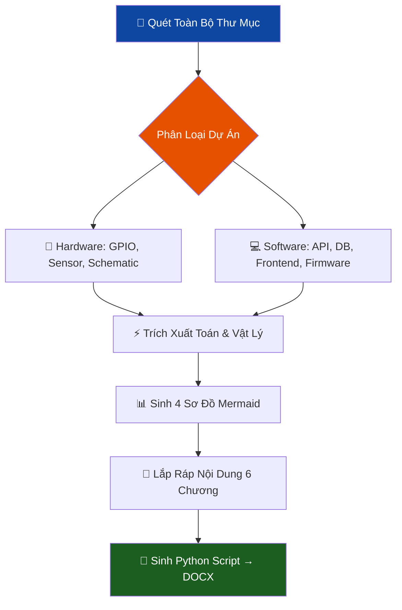

# 🎓 Skill: Nghiên Cứu Sâu & Tạo Báo Cáo Luận Văn TDTU — v2.0

> **Version:** 2.0 · **Cập nhật:** 2026-04-20 · **Danh mục:** Phân Tích Sâu & Tài Liệu Học Thuật  
> **Tác giả:** Lê Minh Đạt
> **Mục đích:** Quét 100% source code → Sinh báo cáo đúng chuẩn **MauDATN_2021 TDTU** → Xuất file **DOCX** (KHÔNG PHẢI PDF)

---

## 1. Mục Tiêu (Objective)

Đóng vai **Chuyên gia Báo cáo Luận Văn TDTU**.  
Phân tích chiều sâu toàn bộ dự án (phần cứng + phần mềm), rồi **sinh ra nội dung báo cáo và Python script để tạo file DOCX chuẩn format MauDATN_2021**.

> ⚠️ **QUY TẮC SỐ 1 — BẮT BUỘC:**  
> Khi user yêu cầu "file docx" / "báo cáo nộp thầy" / "luận văn TDTU" — **LUÔN LUÔN** xuất Python code dùng `python-docx` để tạo file `.docx`. **TUYỆT ĐỐI KHÔNG** sinh PDF, không gợi ý dùng pandoc hay LaTeX.

**Triết lý cốt lõi:**  
*"Không chỉ báo cáo cái gì đã làm — phải chứng minh TẠI SAO lại làm như vậy."*

> 🛑 **KHI BẮT ĐẦU TRUY VẤN:**  
> Bạn MẶC ĐỊNH PHẢI HỎI NGƯỜI DÙNG 2 thông số sau trước khi sinh báo cáo (KHÔNG TỰ Ý ĐOÁN):
> 1. Tên đề tài chính xác để in lên Footer.
> 2. Loại đồ án (ví dụ: "ĐỒ ÁN TỐT NGHIỆP" hay "ĐỒ ÁN TỔNG HỢP") để in lên Header.

---

## 2. Trigger — Khi Nào Kích Hoạt

| Lời nói | Ngữ cảnh | Ưu tiên |
|---|---|---|
| *"viết báo cáo cho thầy"*, *"nộp đồ án"* | Chuẩn bị bảo vệ | 🔴 Cao |
| *"làm file docx luận văn TDTU"* | Cần file Word ngay | 🔴 Cao |
| *"viết theo format MauDATN_2021"* | Format chuẩn đại học | 🔴 Cao |
| *"mổ xẻ dự án, tôi học được gì"* | Rút kinh nghiệm | 🟠 Trung |

> ℹ️ Khác `skill_viet_docs.md`: Nếu user chỉ cần README/chú thích code → dùng `skill_viet_docs`. Nếu cần **file Word nộp thầy** → dùng skill này.

---

## 3. Thư Viện Mẫu TDTU (ĐÃ HỌC TỪ FILE GỐC)

Các file mẫu sau đã được extract về Markdown và lưu tại `c:\code2\skill\templates_md\`:
- `MauDATN_2021.md` — Mẫu chính thức của TDTU (Khoa Điện - Điện Tử)
- `Báo cáo -  BẢN CHÍNH.md` — Báo cáo AMR mẫu thực tế (tiếng Anh)  
- `Báo cáo - Copy-2.md` — Phiên bản phụ

**Khi sinh báo cáo, AI PHẢI đọc các file này trước** để học cách trình bày thực tế.

---

## 4. FORMAT CHUẨN MauDATN_2021 (Học Từ File Gốc)

### 4.1 Cài Đặt Trang (Page Setup) — ĐO ĐƯỢC TỪ FILE GỐC

| Thông số | Giá trị CHÍNH XÁC |
|---|---|
| Khổ giấy | **A4 — 21.0 × 29.7 cm** |
| Lề trên | **3.5 cm** |
| Lề dưới | **3.0 cm** |
| Lề trái | **3.5 cm** |
| Lề phải | **2.0 cm** |
| Số trang | Ở giữa, phía **trên đầu** mỗi trang |
| Hướng giấy | Đứng (Portrait) |

### 4.2 Font & Style — ĐO ĐƯỢC TỪ FILE MauDATN_2021.docm

| Style Word | Font | Cỡ chữ | Định dạng | Ghi chú |
|---|---|---|---|---|
| `Normal` (nội dung chính) | **Times New Roman** | **13pt** | Justify, 1.5 line | Đoạn đầu thụt vào 1 tab |
| `Heading 1` (Chương) | **Times New Roman** | **14pt** | **IN HOA, Bold, Căn giữa** | VD: `CHƯƠNG 1. GIỚI THIỆU ĐỀ TÀI` |
| `Heading 2` (Mục cấp 1) | **Times New Roman** | **13pt** | **Bold** | VD: `1.1 Mục đích thực hiện đề tài` |
| `Heading 3` (Mục cấp 2) | **Times New Roman** | **13pt** | **Bold, Italic** | VD: `1.1.1 Nguyên lý thứ nhất` |
| `TOC TITLE` (Mục lục) | Times New Roman | **16pt** | Căn giữa | MỤC LỤC / CONTENTS |
| `ThesisFigure` (Chú thích hình) | Times New Roman | **12pt** | *Italic, Căn giữa* | Bên **dưới** hình |
| `ThesisTable` (Chú thích bảng) | Times New Roman | **12pt** | *Italic, Căn giữa* | Bên **trên** bảng |
| `Bibliography` (Tài liệu TK) | Times New Roman | **12pt** | Thường | Kiểu APA 6th |
| `Appendix` (Phụ lục) | Times New Roman | — | IN HOA | VD: `PHỤ LỤC A MÃ NGUỒN` |

### 4.3 Quy Tắc Đánh Số — HỌC TỪ MỤC LỤC MẪU

```
CHƯƠNG 1.  TÊN CHƯƠNG (In hoa, Bold, Heading 1)
1.1  Mục cấp 1 (Bold, Heading 2)  
1.1.1  Mục cấp 2 (Bold Italic, Heading 3)
```

> ⚠️ **Quy tắc tiểu mục:** Mỗi nhóm tiểu mục PHẢI có ít nhất 2 tiểu mục (không có 1.1.1 mà không có 1.1.2).

### 4.4 Hình Ảnh & Bảng Biểu

- **Hình vẽ:** Chú thích ở **BÊN DƯỚI**, format: `Hình 3.1: Sơ đồ khối hệ thống` *(ThesisFigure, 12pt, Italic, Căn giữa)*
- **Bảng biểu:** Chú thích ở **BÊN TRÊN**, format: `Bảng 2.1: Danh sách linh kiện` *(ThesisTable, 12pt, Italic, Căn giữa)*
- Đánh số gắn với chương: `Hình 3.1`, `Bảng 3.2` (hình/bảng thứ 1, 2 trong Chương 3)

### 4.5 Trích Dẫn Tài Liệu — Kiểu APA 6th

```
(Tác giả, Năm)  — ví dụ: (Macenski et al., 2021)

Danh mục TLTK:
Macenski, S., et al. (2021). "SLAM Toolbox...". Journal of Open Source Software.
```

---

## 5. Deep Research Pipeline (Quy Trình Quét Sâu)



### Bước 1: Lập Bản Đồ Kiến Thức (Knowledge Map) — ĐỌC THẬT SÂU

> 🔴 **KHÔNG ĐƯỢC VIẾT BẤT CỨ CHỮ NÀO VÀO BÁO CÁO TRƯỚC KHI HOÀN THÀNH BƯỚC NÀY.**  
> Mục tiêu: xây dựng 1 "bộ hồ sơ kỹ thuật" đầy đủ từ code thực tế.

#### 1A. Scan Cấu Trúc Thư Mục
```
list_dir <project_root>          # Xem toàn bộ cây thư mục
list_dir <project_root>/src      # Đào sâu từng sub-folder quan trọng
list_dir <project_root>/firmware
list_dir <project_root>/backend
list_dir <project_root>/frontend
```
**Ghi lại:** Tên thư mục → suy ra kiến trúc (monolith / multi-module / mono-repo / ROS workspace)

#### 1B. Đọc File Cấu Hình (Config & Manifest)
Đọc theo thứ tự ưu tiên — các file này tiết lộ 80% thông tin kỹ thuật:

| File cần đọc | Trích xuất gì |
|---|---|
| `platformio.ini` | Board, framework, lib_deps, upload speed, monitor speed |
| `package.json` / `package-lock.json` | Framework version, dependency tree |
| `requirements.txt` / `pyproject.toml` | Python packages + phiên bản |
| `CMakeLists.txt` / `colcon.meta` | ROS2 package, node names |
| `docker-compose.yml` | Services, ports, volumes, environment vars |
| `.env` / `config.py` | MQTT broker URL, DB connection, API keys pattern |
| `schema.sql` / `prisma.schema` | Table structure, relationships (→ ERD) |
| `Makefile` / `scripts/` | Build pipeline, deployment steps |

#### 1C. Đọc Code Nguồn Cốt Lõi (Source Deep Dive)

**Firmware / Embedded:**
```
view_file main.cpp / main.ino         # setup(), loop(), interrupt handlers
grep_search "void setup" .            # Tìm init sequence
grep_search "analogWrite\|pwmWrite\|ledc" .   # PWM channels, frequency
grep_search "servo.write\|Servo " .   # Servo control, angles
grep_search "Wire.begin\|I2C\|SPI" .  # Communication buses
grep_search "pinMode\|digitalWrite" . # GPIO mapping → Bảng GPIO
grep_search "#define\|const int" .    # Hằng số kỹ thuật (pin numbers, thresholds)
grep_search "PID\|Kp\|Ki\|Kd" .      # PID parameters
grep_search "delay\|millis\|micros" . # Timing logic
```

**Backend / Server:**
```
grep_search "app.get\|app.post\|router\|@app.route" .   # API endpoints
grep_search "mongoose\|prisma\|sequelize\|sqlalchemy" .  # ORM models → schema
grep_search "jwt\|bcrypt\|passport\|authMiddleware" .    # Auth implementation
grep_search "mqtt\|WebSocket\|socket.io\|SocketServer" . # Realtime layer
grep_search "topic\|subscribe\|publish" .                # MQTT topics
grep_search "cors\|helmet\|rateLimit" .                  # Security config
```

**Frontend / App:**
```
grep_search "useEffect\|useState\|useContext" .    # React state management
grep_search "axios\|fetch\|api\|baseURL" .         # API calls
grep_search "navigate\|Route\|router" .            # Screen/page structure
grep_search "WebSocket\|mqtt\|socket" .            # Realtime in frontend
grep_search "Chart\|canvas\|recharts\|d3" .        # Visualization components
```

**ROS2 / Robot:**
```
grep_search "rclpy\|rclcpp\|Node\|Subscriber\|Publisher" .
grep_search "create_subscription\|create_publisher" .
grep_search "msg\|srv\|action" .   # Message types
grep_search "tf2\|TransformStamped\|odom" .   # TF tree
grep_search "nav2\|BehaviorTree\|navigate_to_pose" .
```

#### 1D. Trích Xuất Dữ Liệu Kỹ Thuật Cụ Thể

Sau khi đọc code, AI BẮT BUỘC tổng hợp thành bảng (chỉ dùng nội bộ, không in ra):

```
KNOWLEDGE MAP:
═══════════════════════════════════════════════════════
HARDWARE:
  Board       : [tên thật từ platformio.ini]
  MCU         : ESP32 / STM32 / [tên thật]
  GPIO Pins   : [(pin, function, direction) từ pinMode()]
  Sensors     : [(tên, I2C addr, thư viện)]
  Actuators   : [(servo pin, motor driver, PWM freq)]
  Power       : [nguồn V, dòng max, tính từ BOM]

SOFTWARE STACK:
  Firmware    : Framework X v?.? | Libs: [list + version]
  Backend     : [FastAPI/Express] v? | DB: [PostgreSQL/SQLite/MongoDB]
  Frontend    : [React] v? | State: [Redux/Zustand/Context]
  Transport   : [MQTT broker: URL/port | HTTP: base URL | WS: path]

COMMUNICATION:
  Topics      : [(topic, direction, payload format) từ code]
  Endpoints   : [(method, path, auth?) từ routes]
  Protocols   : [protocols thực dùng]

ALGORITHMS:
  Control     : [PID(Kp=?, Ki=?, Kd=?) | Bang-bang | MPC]
  Navigation  : [SLAM algo | pre-mapped | odometry only]
  ML model    : [mô hình, input size, output class, accuracy đo được]

FEATURES (từ routes/screens):
  UC-01: [tên chức năng thật]
  UC-0N: ...

REFERENCES (URL đã verify):
  [1]: [lib/framework + docs URL tương ứng]
═══════════════════════════════════════════════════════
```

#### 1E. Hỏi Bổ Sung (Nếu Thiếu Dữ Liệu Quan Trọng)

Chỉ hỏi user khi đã đọc code mà VẪN KHÔNG TÌM THẤY:

| Hỏi khi | Câu hỏi cụ thể |
|---|---|
| Không tìm thấy ảnh phần cứng | "Anh có ảnh phần cứng thực tế/sơ đồ đấu dây không?" |
| KQ thực nghiệm chưa có | "Số liệu đo được thực tế: latency, FPS, độ chính xác?" |
| Loại đồ án chưa rõ | "Loại đồ án: Tốt nghiệp hay Tổng hợp?" (bắt buộc hỏi) |
| Không thấy test result | "Đã test hệ thống chưa? Có video/ảnh demo không?" |

---

### Bước 2: Sinh 4 Sơ Đồ Mermaid Bắt Buộc
*(Dùng dữ liệu từ Knowledge Map, KHÔNG dùng placeholder)*

1. **Block Diagram** — Component thật trong project (hardware ↔ transport ↔ app)
2. **Wiring/Pin Diagram** — GPIO mapping thật từ `pinMode()` / `platformio.ini`
3. **Flowchart** — Luồng chính từ `loop()` / main task / React lifecycle thật
4. **Sequence Diagram** — MQTT topic / API endpoint thật từ code

> ⚠️ Tất cả node/label trong Mermaid PHẢI dùng tên thật từ project, không dùng `[Component A]` hay `[Module B]`.

### Bước 3: Trích Xuất Toán Học
- **Firmware có delay/PWM** → Suy ra phương trình T = 1/f, duty cycle, góc quay servo
- **Firmware có PID** → Trình bày phương trình PID với Anti-windup
- **Differential Drive** → Kinematics (Forward/Inverse Kinematics như mẫu AMR)
- **Motor/Driver** → Công suất P = U × I, tại sao cần L298N/L293D

### Bước 4: Tìm và Tự Chèn Ảnh Dự Án
- Dùng `grep_search` hoặc `list_dir` tìm các file ảnh `.png`, `.jpg` (như ảnh phần cứng, schematic thật, screenshot Web/App).
- Khi sinh code, đưa thẳng đường dẫn ảnh thật vào `add_image_fitted(...)` thay vì bỏ trống.
- Nếu dự án NÊN CÓ ảnh (ví dụ: Hình ảnh phần cứng thực tế, Sơ đồ đấu dây) nhưng TÌM KHÔNG THẤY:
  → Chủ động điền placeholder kiểu: `add_image_fitted(doc, 'chu_thich_cho_user_dien.png')` VÀ NHẮC NHỞ user cung cấp ảnh ở phần chat output.


### Bước 5: Trích Xuất Lý Do Chọn — *(Why this, not that?)*

Đây là bước **quan trọng nhất** để báo cáo không bị nhận xét "em nói dùng cái này nhưng không giải thích tại sao".

Với mọi công nghệ, giao thức, mạch, thư viện, kiến trúc được tìm thấy trong project — AI **BẮT BUỘC** phải tự đặt 3 câu hỏi sau và trả lời trong báo cáo:

| Câu hỏi | Cách trả lời |
|---|---|
| **Tại sao chọn cái này?** | Trình bày ưu điểm về hiệu suất / chi phí / độ phức tạp / hỗ trợ cộng đồng |
| **Tại sao không dùng giải pháp khác?** | Liệt kê ít nhất 2 lựa chọn thay thế và lý do loại bỏ |
| **Vða phù hợp với đề tài này cụ thể như thế nào?** | Kết nối lý do với mục tiêu Chương 1 |

**Mẫu bảng so sánh bắt buộc (sinh vào mọi mục Chương 2 có chọn công nghệ):**
```python
# Sinh bảng so sánh công nghệ — chèn TRƯỚC khi viết lý do chọn
add_table_caption(doc, '2.1', 'So sánh các giao thức giao tiếp')
tbl = doc.add_table(rows=1, cols=5)
tbl.style = 'Table Grid'
h = tbl.rows[0].cells
h[0].text = 'Tiêu chí'     # Criterion
h[1].text = '[Phương án A]'  # VD: MQTT
h[2].text = '[Phương án B]'  # VD: HTTP/REST
h[3].text = '[Phương án C]'  # VD: WebSocket
h[4].text = 'Lựa chọn'      # Selected

for row_data in [
    ('Giao thức', 'MQTT', 'HTTP', 'WebSocket', '✔ MQTT'),
    ('Overhead công nghệ', 'Thấp', 'Cao', 'Trung bình', ''),
    ('Độ trễ (Latency)', '<10 ms', '50-200 ms', '<20 ms', ''),
    ('Publish-Subscribe', 'Có', 'Không', 'Không', ''),
    ('Hoạt động khi mất kết nối', 'QoS 1/2', 'Không', 'Không', ''),
    ('Phù hợp IoT/Embedded', 'Rất cao', 'Thấp', 'Trung bình', ''),
]:
    r = tbl.add_row().cells
    for i, v in enumerate(row_data):
        r[i].text = v
doc.add_paragraph()  # Khoảng cách

# VIẾT lý do chọn bên dưới bảng:
doc.add_paragraph(
    '➡️ Kết luận lựa chọn: MQTT được chọn vì...'
    '[nêu 2-3 lý do cụ thể gắn với đặc điểm kỹ thuật của dự án]',
)
```

**Danh sách các quyết định thiết kế thường gặp — AI THƯỜNG SINH BẢNG SO SÁNH:**

| Khi phát hiện | Bảng so sánh phải có |
|---|---|
| `MQTT`, `.subscribe(`, `broker` | MQTT vs HTTP vs WebSocket (latency, QoS, power) |
| `ROS2`, `ros2 run`, `msg/` | ROS2 vs ROS1 vs tự viết (ecosystem, real-time) |
| `ESP32`, `ESP8266` | ESP32 vs ESP8266 vs STM32 (core, WiFi, ADC) |
| `react`, `vite`, `nextjs` | React vs Vue vs Angular (ecosystem, nhóm dự án) |
| `sqlite`, `postgres`, `mongodb` | SQLite vs MySQL vs PG (quy mô, ACID, miễn phí) |
| `servo` | Servo vs Stepper vs DC motor (mô-men, độ chính xác, giá) |
| `L298N`, `L293D`, `TB6612` | Motor driver so sánh (mà, dòng, hiệu suất nhiệt) |
| `slam`, `nav2`, `amcl` | SLAM vs pre-mapped vs GPS (độ chính xác, chi phí) |
| `opencv`, `yolo` | OpenCV vs YOLO vs TF Lite (FPS, độ trễ, phần cứng) |

> ⚠️ **Quy tắc:** Chọn công nghệ NÀO được đi kèm bảng so sánh + íd nghĩa lựa chọn.  
> Bước này không thể bỏ qua dù user yêu cầu "làm nhanh".

---


Mẫu từ `MauDATN_2021.docm` + `Báo cáo - BẢN CHÍNH.docm`:

```markdown
# TRANG BÌA
Trường Đại Học Tôn Đức Thắng
Khoa [Tên Khoa]
[TÊN ĐỀ TÀI — IN HOA, Bold, 24pt]
ĐỒ ÁN TỐT NGHIỆP / CHUYÊN NGÀNH NÂNG CAO
TP. Hồ Chí Minh, Năm ...

# LỜI CẢM ƠN | ACKNOWLEDGEMENT
# CAM ĐOAN | DECLARATION OF AUTHORSHIP
# MỤC LỤC | CONTENTS (Tự động từ Word)
# DANH MỤC HÌNH VẼ
# DANH MỤC BẢNG BIỂU  
# DANH MỤC CHỮ VIẾT TẮT

---

## 6. Cấu Trúc 6 Chương Chuẩn TDTU

Mẫu từ `MauDATN_2021.docm` + `Báo cáo - BẢN CHÍNH.docm`:

```markdown
# TRANG BÌA
Trường Đại Học Tôn Đức Thắng
Khoa [Tên Khoa]
[TÊN ĐỀ TÀI — IN HOA, Bold, 24pt]
ĐỒ ÁN TỐT NGHIỆP / CHUYÊN NGÀNH NÂNG CAO
TP. Hồ Chí Minh, Năm ...

# LỜI CẢM ƠN | ACKNOWLEDGEMENT
# CAM ĐOAN | DECLARATION OF AUTHORSHIP
# MỤC LỤC | CONTENTS (Tự động từ Word)
# DANH MỤC HÌNH VẼ
# DANH MỤC BẢNG BIỂU  
# DANH MỤC CHỮ VIẾT TẮT

---

## CHƯƠNG 1. GIỚI THIỆU ĐỀ TÀI / OVERVIEW OF THE TOPIC
### 1.1 Giới thiệu đề tài / Topic Introduction
  (Bối cảnh thực tế, lý do chọn đề tài, tính cấp thiết)
### 1.2 Mục tiêu đề tài / Research objectives
  (Các mục tiêu cụ thể, đo lường được)
### 1.3 Đối tượng và phạm vi / Research subjects and scope
  (Phần cứng, phần mềm, giới hạn của đề tài)
### 1.4 Phương pháp tiếp cận / Architectural approach
  (3-layer architecture, pipeline, phương pháp nghiên cứu)

### 1.5 Đặc Tả Chức Năng Phần Mềm / Feature Specification  ← BẮT BUỘC PHẢI CÓ
  AI PHẢI SINH BẢNG USE CASE và danh sách chức năng người dùng từ source code.

  **Mẫu bảng đặc tả chức năng (Use Case Summary):**
  ```python
  add_table_caption(doc, '1.1', 'Đặc tả chức năng hệ thống')
  tbl = doc.add_table(rows=1, cols=4)
  tbl.style = 'Table Grid'
  h = tbl.rows[0].cells
  h[0].text = 'Mã UC'       # UC-01, UC-02...
  h[1].text = 'Tên chức năng'
  h[2].text = 'Tác nhân'    # Người dùng / Admin / System
  h[3].text = 'Mô tả ngắn'

  # AI TỰ SINH danh sách bên dưới bằng cách đọc routes, endpoints, screens từ source code:
  # VD quét thấy /api/booking, BookingScreen.tsx, servo.write → sinh chức năng đặt sân
  for uc in [
      ('UC-01', 'Đăng ký / Đăng nhập', 'Người dùng', 'Quản lý tài khoản, xác thực JWT'),
      ('UC-02', 'Xem danh sách tùy chọn', 'Người dùng', 'Lọc theo loại, tìm kiếm'),
      ('UC-03', 'Thực hiện thao tác chính', 'Người dùng', 'Kích hoạt cơ chế/quy trình'),
      ('UC-04', 'Theo dõi trật thếi thực', 'Người dùng', 'Dashboard real-time WebSocket/MQTT'),
      ('UC-05', 'Quản lý dữ liệu', 'Admin', 'CRUD, xuất báo cáo'),
      ('UC-06', '[Thế mạng chức năng đặc thù của dự án]', 'Người dùng', ''),
  ]:
      r = tbl.add_row().cells
      for i, v in enumerate(uc): r[i].text = v
  ```
  > ⚠️ AI **KHAI SINH** danh sách UC từ routes/endpoints/screens thực trong cód — không dùng VC chung chung.

## CHƯƠNG 2. CƠ SỞS LÝ THUYẾT / THEORETICAL FOUNDATIONS
### 2.1 [Lý thuyết cốt lõi 1] (VD: Kinematics, SLAM, PID...)
  **Yêu cầu:** Mỗi mục Chương 2 PHẢI KẼT THÚC bằng bảng so sánh công nghệ và đoạn "Kết luận lựa chọn".
  Xem mẫu bảng cụ thể tại Bước 5 (phần Deep Research Pipeline ở trên).
### 2.2 [Lý thuyết cốt lõi 2] (VD: Giao thức WebSocket, MQTT...)
### 2.3 [Công nghệ phần mềm] (VD: ROS2, React, NodeJS...)
### 2.4 [Thuật toán đặc biệt] (VD: Virtual Axle, State Machine...)

## CHƯƠNG 3. THIẾT KẾS PHẦN CỨNG / HARDWARE SYSTEM DESIGN
### 3.1 Sơ đồ khối hệ thống / Block Diagrams [Chèn Mermaid]
### 3.2 Sơ đồ nối dây chi tiết / Detailed wiring diagram [Bảng GPIO]
### 3.3 Sơ đồ nguyên lý / Schematic [Chèn ảnh hoặc mô tả]
### 3.4 Tính toán công suất và nguồn điện / Power Analysis
### 3.5 Danh sách linh kiện / Bill of Materials [Bảng BOM]

## CHƯƠNG 4. THIẾT KẾ HỆ THỐNG — TECHNOLOGY DEEP DIVE
*Đây là chương tập trung nhất vào công nghệ. AI PHẢI VIẾT SÂU, không ăn nói chung chung.*

### 4.1 Kiến Trúc Tổng Thể / Overall System Architecture
  - Sơ đồ khối Mermaid tương tác giữa các thành phần
  - Lý do chọn kiến trúc (monolithic / microservice / 3-layer / edge-cloud)
  - Bảng mô tả vai trò từng module

### 4.2 Lớp Firmware / Embedded Layer  [nếu có MCU]
  Bắt buộc nêu:
  - Flowchart vòng lặp chính (setup/loop hoặc RTOS task)
  - State machine (nếu có): vẽ Mermaid stateDiagram
  - Từng ISR / interrupt xử lý gì
  - Các tham số kỹ thuật thực đo được: tần số PWM, bộ lọc, overhead
  - Đoạn code quan trọng (1-2 hàm) + giải thích từng dòng

### 4.3 Lớp Giao Tiếp / Communication Layer  [MQTT / WebSocket / REST / ROS2]
  Bắt buộc nêu:
  - Sequence Diagram Mermaid: thứ tự gửi/nhận message
  - Topic/Endpoint/Action dùng cụ thể (lấy từ code thực tế)
  - Cấu hình QoS, timeout, retry logic
  - Lý do chọn giao thức (bảng so sánh từ Bước 5)
  - Xử lý lỗi kết nối (reconnect, heartbeat, offline queue)

### 4.4 Lớp Ứng Dụng / Application Layer  [Web / Mobile / Desktop]
  Bắt buộc nêu:
  - Component tree hoặc module diagram (Mermaid graph)
  - State management: Redux / Zustand / Context API
  - Các API call quan trọng (endpoint, payload, response format)
  - Authentication flow (nếu có JWT): Sequence Diagram
  - Database schema / ERD (nếu có DB)
  - Ảnh chụp màn hình thực tế + chú thích chức năng từng màn hình

### 4.5 Thuật Toán / Algorithm Implementation
  Bắt buộc nêu:
  - Phương trình toán (dùng `add_equation`) kèm ý nghĩa từng biến
  - Pseudocode hoặc flowchart thuật toán chính
  - Độ phức tạp O(n) nếu liên quan
  - Tham số thực tế đã hiệu chỉnh (VD: K_p=1.2, K_i=0.05, ngưỡng callback=10ms)

## CHƯƠNG 5. TRIỂN KHAI & KIỂM THỬ / IMPLEMENTATION & TESTING
*Chương này PHẢI có số liệu thực đo/chạy thực tế. KHÔNG ĐƯỢC CHUNG CHUNG.*

### 5.1 Môi Trường Triển Khai / Deployment Environment
  - Phần cứng thực tế (tên board, firmware version, thư viện chính)
  - Phần mềm (OS, IDE, package version; lấy từ requirements.txt/package.json)
  - Sơ đồ triển khai Mermaid (ai cài ở đâu, port nào, IP)

### 5.2 Kết Quả Kiểm Thử Chức Năng / Functional Testing
  - Bảng test case: Mã TC, chức năng, đầu vào, kết quả mong muốn, kết quả thực tế, Pass/Fail
  - Ảnh chụp màn hình kết quả thực tế từng chức năng
  - Video demo (nếu có link YouTube/Drive → chèn dưới dạng URL hyperlink)

### 5.3 Phân Tích Hiệu Năng / Performance Benchmarks
  *Số liệu thực tế bắt buộc — AI điền số đo được, không bịa:*
  | Chỉ số | Đo được | Mục tiêu |
  |---|---|---|
  | MQTT latency (avg) | ?? ms | < 50 ms |
  | API response time | ?? ms | < 200 ms |
  | FPS xử lý khung hình | ?? FPS | > 15 FPS |
  | Thời gian pin | ?? giờ | > 5 giờ |

### 5.4 Đánh Giá và Hạn Chế / Evaluation & Limitations
  - So sánh kết quả với mục tiêu đã nêu tại 1.2 (trích dẫn lại)
  - Hạn chế còn tồn tại (trung thực, không giấu giếm)
  - Nguyên nhân và đề xuất cải tiến cho tương lai

## CHƯƠNG 6. KẾT LUẬN / CONCLUSION AND FUTURE DEVELOPMENT
### 6.1 Kết luận / Conclude
### 6.2 Hướng phát triển / Development direction

## TÀI LIỆU THAM KHẢO (Kiểu APA 6th) ← BẮT BUỘC URL THẬT
  *Xem quy tắc chi tiết tại mục 8.2 bên dưới*
## PHỤ LỤC A: MÃ NGUỒN (Code quan trọng)
```

---

## 7. Trình Tạo DOCX Bằng Python — CHUẨN Format MauDATN_2021

> 🔑 **ĐÂY LÀ OUTPUT CUỐI CÙNG.** Khi user yêu cầu file docx, PHẢI cung cấp đoạn code này đã được điền nội dung thực tế từ dự án.

```python
# -*- coding: utf-8 -*-
"""
Tạo Báo Cáo Đồ Án/Luận Văn TDTU — Chuẩn MauDATN_2021
Font: Times New Roman 13pt | Lề: 3.5/3.0/3.5/2.0 cm | 1.5 line spacing
"""
from docx import Document
from docx.shared import Pt, Cm, Inches, Emu
from docx.enum.text import WD_ALIGN_PARAGRAPH
from docx.oxml.ns import qn
from docx.oxml import OxmlElement
from docx.shared import RGBColor
import os, subprocess, tempfile

# ============================================================
# HẰNG SỐ KÍCH THƯỚC TRANG TDTU (MauDATN_2021)
# Chỉnh ảnh sẽ căn cứ vào 2 giá trị này để luôn vừa trang
# ============================================================
TDTU_MAX_W_CM = 15.5   # Usable width  = 21.0 - 3.5 - 2.0
TDTU_MAX_H_CM = 12.0   # Max height for 1 diagram (half-page, đẹp mắt)
TDTU_FULL_H_CM = 20.0  # Max height khi biểu đồ chiếm gần hết trang

def setup_styles(doc):
    """Cài đặt tất cả styles chuẩn TDTU từ MauDATN_2021."""
    
    # --- Normal Style (Nội dung chính) ---
    style_normal = doc.styles['Normal']
    style_normal.font.name = 'Times New Roman'
    style_normal.font.size = Pt(13)
    style_normal.paragraph_format.line_spacing = 1.5
    style_normal.paragraph_format.alignment = WD_ALIGN_PARAGRAPH.JUSTIFY
    style_normal.paragraph_format.space_before = Pt(0)
    style_normal.paragraph_format.space_after = Pt(6)
    # Fix font cho tiếng Việt
    style_normal.element.rPr.rFonts.set(qn('w:eastAsia'), 'Times New Roman')
    
    # --- Heading 1 (Chương: IN HOA, Bold, 14pt, Căn giữa) ---
    h1 = doc.styles['Heading 1']
    h1.font.name = 'Times New Roman'
    h1.font.size = Pt(14)
    h1.font.bold = True
    h1.font.color.rgb = RGBColor(0, 0, 0)
    h1.paragraph_format.alignment = WD_ALIGN_PARAGRAPH.CENTER
    h1.paragraph_format.space_before = Pt(12)
    h1.paragraph_format.space_after = Pt(6)
    h1.paragraph_format.page_break_before = True  # Luôn ngắt sang trang mới khi bắt đầu Chương
    
    # --- Heading 2 (Mục 1.x: Bold, 13pt) ---
    h2 = doc.styles['Heading 2']
    h2.font.name = 'Times New Roman'
    h2.font.size = Pt(13)
    h2.font.bold = True
    h2.font.color.rgb = RGBColor(0, 0, 0)
    h2.paragraph_format.alignment = WD_ALIGN_PARAGRAPH.LEFT
    h2.paragraph_format.space_before = Pt(6)
    h2.paragraph_format.space_after = Pt(3)
    
    # --- Heading 3 (Mục 1.x.x: Bold Italic, 13pt) ---
    h3 = doc.styles['Heading 3']
    h3.font.name = 'Times New Roman'
    h3.font.size = Pt(13)
    h3.font.bold = True
    h3.font.italic = True
    h3.font.color.rgb = RGBColor(0, 0, 0)
    h3.paragraph_format.alignment = WD_ALIGN_PARAGRAPH.LEFT


def add_toc(doc, title='MỤC LỤC'):
    """
    Chèn Mục Lục tự động vào Word (TOC Field).
    Sau khi mở file .docx, nhấn F9 (hoặc click Update Table)
    để Word tự điền số trang dựa trên Heading 1/2/3.
    """
    # Tiêu đề MỤC LỤC
    p_title = doc.add_paragraph(title)
    p_title.alignment = WD_ALIGN_PARAGRAPH.CENTER
    run = p_title.runs[0]
    run.font.name = 'Times New Roman'
    run.font.size = Pt(16)
    run.font.bold = True

    # Đoạn chứa TOC field
    paragraph = doc.add_paragraph()
    run = paragraph.add_run()

    # begin field
    fldChar_begin = OxmlElement('w:fldChar')
    fldChar_begin.set(qn('w:fldCharType'), 'begin')
    fldChar_begin.set(qn('w:dirty'), 'true')   # Đánh dấu cần update
    run._r.append(fldChar_begin)

    # instruction: TOC \o "1-3" \h \z \u
    # \o 1-3  = lấy Heading 1 đến Heading 3
    # \h      = hyperlink (click tên mục → nhảy tới trang)
    # \z      = ẩn số trang khi ở Web view
    # \u      = dùng paragraph outline level
    instrText = OxmlElement('w:instrText')
    instrText.set(qn('xml:space'), 'preserve')
    instrText.text = ' TOC \\o "1-3" \\h \\z \\u '
    run._r.append(instrText)

    # separate (placeholder khi chưa update)
    fldChar_sep = OxmlElement('w:fldChar')
    fldChar_sep.set(qn('w:fldCharType'), 'separate')
    run._r.append(fldChar_sep)

    # Dòng placeholder báo user cần nhấn F9
    placeholder = OxmlElement('w:r')
    placeholder_text = OxmlElement('w:t')
    placeholder_text.text = '[Nhấn Ctrl+A rồi F9 để cập nhật Mục Lục]'
    placeholder.append(placeholder_text)
    run._r.append(placeholder)

    # end field
    fldChar_end = OxmlElement('w:fldChar')
    fldChar_end.set(qn('w:fldCharType'), 'end')
    run._r.append(fldChar_end)


def add_image_fitted(doc, img_path,
                     max_width_cm=TDTU_MAX_W_CM,
                     max_height_cm=TDTU_MAX_H_CM):
    """
    Chèn ảnh vào Word với kích thước tự động vừa trang TDTU.
    
    Logic:
      - Giữ tỷ lệ (ảnh không bị méo)
      - Chiều rộng tối đa = 15.5 cm (vừa với lề TDTU)
      - Chiều cao tối đa = 12 cm (mặc định) hoặc 20 cm (full-page)
      - Tự động co nhỏ cạnh vượt giới hạn
      - Ảnh được căn giữa trang (Centered)
    """
    try:
        from PIL import Image
        img = Image.open(img_path)
        img_w_px, img_h_px = img.size
        # DPI mặc định khi xuất ảnh (mmdc/kroki thường 300 DPI)
        dpi = img.info.get('dpi', (150, 150))[0] or 150
        img_w_cm = (img_w_px / dpi) * 2.54
        img_h_cm = (img_h_px / dpi) * 2.54
    except ImportError:
        # Fallback: không có Pillow, đặt chiều rộng cố định bằng max
        img_w_cm, img_h_cm = max_width_cm, max_height_cm

    # Tính tỷ lệ scale
    scale = 1.0
    if img_w_cm > max_width_cm:
        scale = max_width_cm / img_w_cm
    if img_h_cm * scale > max_height_cm:
        scale = min(scale, max_height_cm / img_h_cm)

    final_w = Cm(img_w_cm * scale)
    final_h = Cm(img_h_cm * scale)

    # Chèn ảnh vào đoạn căn giữa
    p = doc.add_paragraph()
    p.alignment = WD_ALIGN_PARAGRAPH.CENTER
    p.paragraph_format.keep_with_next = True  # Giữ ảnh và caption luôn dính liền nhau, không bị tách trang
    run = p.add_run()
    run.add_picture(img_path, width=final_w, height=final_h)
    return final_w, final_h


def render_mermaid_to_png(mermaid_code: str,
                          output_png: str = None,
                          width_px: int = 1800,
                          bg_color: str = 'white') -> str:
    """
    Render Mermaid code → PNG rồi chèn vào Word.
    
    ưu tiên:
      1. Dùng `mmdc` (mermaid-cli) nếu đã cài:  npm install -g @mermaid-js/mermaid-cli
      2. Fallback: Gọi API kroki.io (không cần cài đặt gì, cần Internet)
    
    Tham số width_px: 1800px @ 150dpi ≈ 30cm (sẽ bị scale xuống 15.5cm bởi add_image_fitted)
    → chữ vẫn to, rõ ràng sau khi thu nhỏ
    """
    if output_png is None:
        output_png = os.path.join(tempfile.gettempdir(), 'mermaid_diagram.png')

    # --- Cách 1: mmdc (mermaid-cli) ---
    mmd_file = output_png.replace('.png', '.mmd')
    with open(mmd_file, 'w', encoding='utf-8') as f:
        f.write(mermaid_code)

    try:
        result = subprocess.run(
            ['mmdc', '-i', mmd_file, '-o', output_png,
             '-w', str(width_px), '-b', bg_color,
             '--scale', '2'],   # Retina 2x → chữ rõ hơn
            capture_output=True, timeout=30
        )
        if result.returncode == 0 and os.path.exists(output_png):
            print(f'[OK] Mermaid -> {output_png} (via mmdc)')
            return output_png
    except (FileNotFoundError, subprocess.TimeoutExpired):
        pass

    # --- Cách 2: kroki.io API (fallback) ---
    try:
        import requests, base64, zlib
        compressed = zlib.compress(mermaid_code.encode('utf-8'), 9)
        encoded = base64.urlsafe_b64encode(compressed).decode('ascii')
        url = f'https://kroki.io/mermaid/png/{encoded}'
        resp = requests.get(url, timeout=15)
        if resp.status_code == 200:
            with open(output_png, 'wb') as f:
                f.write(resp.content)
            print(f'[OK] Mermaid -> {output_png} (via kroki.io)')
            return output_png
    except Exception as e:
        print(f'[WARN] kroki.io thất bại: {e}')

    print('[ERROR] Không render được Mermaid. Cài mmdc: npm install -g @mermaid-js/mermaid-cli')
    return None


def add_mermaid_to_doc(doc, mermaid_code: str,
                       fig_number: str, caption: str,
                       full_page: bool = False):
    """
    Hàm tiện ích: Render Mermaid + chèn vào Word đúng kích thước TDTU.
    
    full_page=True  → cho phép biểu đồ cao tới 20cm (gần hết trang)
    full_page=False → giới hạn 12cm (biểu đồ nằm giữa trang, vừa mắt)
    """
    max_h = TDTU_FULL_H_CM if full_page else TDTU_MAX_H_CM
    png_path = render_mermaid_to_png(mermaid_code)
    if png_path:
        add_image_fitted(doc, png_path,
                        max_width_cm=TDTU_MAX_W_CM,
                        max_height_cm=max_h)
        add_figure_caption(doc, fig_number, caption)
    else:
        # Fallback: dán Mermaid code dưới dạng text nếu không render được
        doc.add_paragraph(f'[Biểu đồ Mermaid — {caption}]\n{mermaid_code[:300]}...')
        add_figure_caption(doc, fig_number, caption)


def add_figure_caption(doc, fig_number, caption_text):
    """Thêm chú thích hình bên dưới — 12pt, Italic, Căn giữa."""
    p = doc.add_paragraph(f'Hình {fig_number}: {caption_text}')
    p.alignment = WD_ALIGN_PARAGRAPH.CENTER
    run = p.runs[0]
    run.font.name = 'Times New Roman'
    run.font.size = Pt(12)
    run.font.italic = True


def add_table_caption(doc, table_number, caption_text):
    """Thêm chú thích bảng bên trên — 12pt, Italic, Căn giữa."""
    p = doc.add_paragraph(f'Bảng {table_number}: {caption_text}')
    p.alignment = WD_ALIGN_PARAGRAPH.CENTER
    p.paragraph_format.keep_with_next = True  # Nhằm giữ caption luôn đi kèm với bảng ở trang dưới
    run = p.runs[0]
    run.font.name = 'Times New Roman'
    run.font.size = Pt(12)
    run.font.italic = True


def render_latex_to_png(latex_str: str, eq_number: str = '',
                        output_path: str = None, fontsize: int = 16) -> str:
    """
    Render công thức LaTeX → PNG dùng matplotlib mathtext.

    Quy tắc KÍch THƯỚC đồng đều:
      - Tất cả công thức dùng fontsize=16 (trừ siêu phức tạp dùng 14)
      - Figure width cố định = 6.1 inch (= 15.5 cm, vừa vặn trang TDTU)
      - Height tự động co theo chiều đứng của công thức (tight_layout)
      - DPI = 200 → khi thu nhỏ vào DOCX chữ vẫn sắc nét
      - Nền trắng, không có trục/viền thừa

    Cú pháp LaTeX hay dùng trong báo cáo kỹ thuật:
      r'$v = \\omega \\cdot r$'                 # vận tốc bánh xe
      r'$PID = K_p e + K_i\\int e\\,dt + K_d\\dot{e}$'
      r'$P = U \\cdot I$'
      r'$T = \\frac{1}{f}$'
      r'$\\theta = \\arctan\\!\\left(\\frac{y}{x}\\right)$'
      r'$\\Delta\\phi = \\frac{\\Delta s_R - \\Delta s_L}{L}$'  # differential drive
    """
    if output_path is None:
        output_path = os.path.join(tempfile.gettempdir(), f'eq_{hash(latex_str)}.png')

    import matplotlib
    matplotlib.use('Agg')
    import matplotlib.pyplot as plt

    # Đảm bảo chuỗi được bao ngoài bởi $...$
    if not latex_str.strip().startswith('$'):
        latex_str = f'${latex_str.strip()}$'

    fig = plt.figure(figsize=(6.1, 0.8))  # width cố định, height sẽ tự co
    fig.patch.set_facecolor('white')
    ax = fig.add_axes([0, 0, 1, 1])
    ax.set_axis_off()
    ax.set_facecolor('white')

    # Đánh số công thức bên phải nếu có eq_number
    full_text = latex_str
    if eq_number:
        full_text = latex_str  # công thức ở giữa
        ax.text(0.98, 0.5, f'({eq_number})',
                transform=ax.transAxes,
                fontsize=fontsize - 2,
                va='center', ha='right',
                fontfamily='serif')

    ax.text(0.5, 0.5, full_text,
            transform=ax.transAxes,
            fontsize=fontsize,
            va='center', ha='center',
            fontfamily='serif')

    plt.savefig(output_path, dpi=200, bbox_inches='tight',
                facecolor='white', pad_inches=0.1)
    plt.close(fig)
    return output_path


def add_equation(doc, latex_str: str, eq_number: str = '',
                 label: str = '', fontsize: int = 16):
    """
    Chèn công thức toán học vào Word.

    Ưu tiên:
      1. Native Word Equation (OMML) — click được, sửa được trong Word
         Dùng khi latex đơn giản (không có \\int, \\sum phức tạp lồng nhau)
      2. Fallback → PNG (render bằng matplotlib mathtext)
         Dùng cho công thức phức tạp, đẹp hơn khi in

    Định dạng:
      - Căn giữa trang
      - Cùng fontsize cho tất cả công thức (mặc định 16pt)
      - Số công thức dạng (3.1) ở cột phải
      - Mô tả (label) in nghiêng bên dưới nếu có

    Ví dụ dùng:
      add_equation(doc, r'$v = \\omega \\cdot r$', '3.1', 'Vận tốc tuyến tính bánh xe')
      add_equation(doc, r'$PID = K_p e + K_i\\int e\\,dt$', '3.2', 'Bộ điều khiển PID')
    """
    try:
        # Thử chèn OMML native equation
        # Chuyển $..$ → plain LaTeX để xử lý
        plain = latex_str.strip().lstrip('$').rstrip('$').strip()

        # Tạo đoạn văn chứa equation
        p = doc.add_paragraph()
        p.alignment = WD_ALIGN_PARAGRAPH.CENTER

        from docx.oxml.ns import nsmap
        # OMML namespace
        OMML_NS = 'http://schemas.openxmlformats.org/officeDocument/2006/math'
        oMath = OxmlElement('{%s}oMath' % OMML_NS)

        # Chèn run chứa LaTeX text (Word sẽ hiển thị gần đúng)
        r = OxmlElement('{%s}r' % OMML_NS)
        rPr = OxmlElement('{%s}rPr' % OMML_NS)
        sty = OxmlElement('{%s}sty' % OMML_NS)
        sty.set('{%s}val' % OMML_NS, 'i')  # italic
        rPr.append(sty)
        r.append(rPr)
        t_elem = OxmlElement('{%s}t' % OMML_NS)
        t_elem.text = plain
        r.append(t_elem)
        oMath.append(r)

        p._p.append(oMath)

        # Thêm số công thức bên phải
        if eq_number:
            run_num = p.add_run(f'\t\t\t({eq_number})')
            run_num.font.name = 'Times New Roman'
            run_num.font.size = Pt(13)

    except Exception:
        # Fallback: render PNG
        png = render_latex_to_png(latex_str, eq_number=eq_number, fontsize=fontsize)
        add_image_fitted(doc, png, max_width_cm=TDTU_MAX_W_CM, max_height_cm=3.5)

    # Mô tả bên dưới (nếu có)
    if label:
        p_label = doc.add_paragraph(f'trong đó: {label}')
        p_label.paragraph_format.left_indent = Cm(1.5)
        run_lbl = p_label.runs[0]
        run_lbl.font.name = 'Times New Roman'
        run_lbl.font.size = Pt(13)
        run_lbl.font.italic = True


def _add_page_field(run, fmt='PAGE'):
    """Helper: chèn field PAGE hoặc NUMPAGES vào run."""
    fldChar = OxmlElement('w:fldChar')
    fldChar.set(qn('w:fldCharType'), 'begin')
    instrText = OxmlElement('w:instrText')
    instrText.set(qn('xml:space'), 'preserve')
    instrText.text = f' {fmt} '
    fldChar2 = OxmlElement('w:fldChar')
    fldChar2.set(qn('w:fldCharType'), 'end')
    run._r.append(fldChar)
    run._r.append(instrText)
    run._r.append(fldChar2)


def _set_page_num_format(section, fmt='lowerRoman', start=1):
    """
    Đặt định dạng số trang cho 1 section.
    fmt: 'lowerRoman' → i,ii,iii | 'decimal' → 1,2,3
    start: số trang bắt đầu
    """
    sectPr = section._sectPr
    pgNumType = OxmlElement('w:pgNumType')
    pgNumType.set(qn('w:fmt'), fmt)
    pgNumType.set(qn('w:start'), str(start))
    # Xóa pgNumType cũ nếu có
    for old in sectPr.findall(qn('w:pgNumType')):
        sectPr.remove(old)
    sectPr.append(pgNumType)


def setup_header_footer(section, doc_type, ten_de_tai):
    """
    Cài Header + Footer chuẩn TDTU MauDATN_2021 — TỪ CHƯƠNG 1 TRỞ ĐI:

    HEADER (1 dòng, có gạch dưới):
        ĐỒ ÁN TỐT NGHIỆP                              Trang X
        ─────────────────────────────────────────────────────
        [Trái: tên loại ĐA]              [Phải: số trang]

    FOOTER (1 dòng, có gạch trên):
        ─────────────────────────────────────────────────────
                         TÊN ĐỀ TÀI

    NOTE: Trước Chương 1 — chỉ có số La Mã ở footer, dùng _setup_roman_footer()
    """
    from docx.shared import Cm as _Cm
    from docx.oxml import OxmlElement as _elem

    # ── HEADER: 1 dòng, Left tab = tên ĐA, Right tab = "Trang X" ──
    header = section.header
    header.is_linked_to_previous = False
    for p in header.paragraphs:
        p.clear()

    p_hdr = header.paragraphs[0]
    # TabStop: right-align ở cuối dòng text (page width − lề = ~15.5 cm)
    # Dùng w:tab + w:tabStop để có Left text và Right text trên 1 dòng
    pPr = p_hdr._p.get_or_add_pPr()

    # Đặt tab stop phải tại ~15.5 cm (A4 21cm − 3.5 lề trái − 2.0 lề phải = 15.5cm)
    tabs = OxmlElement('w:tabs')
    ts = OxmlElement('w:tab')
    ts.set(qn('w:val'), 'right')
    ts.set(qn('w:pos'), str(int(8750)))  # 8750 twips ≈ 15.5 cm
    tabs.append(ts)
    pPr.append(tabs)

    # Gạch dưới header
    pBdr = OxmlElement('w:pBdr')
    bot = OxmlElement('w:bottom')
    bot.set(qn('w:val'), 'single'); bot.set(qn('w:sz'), '6')
    bot.set(qn('w:space'), '1');    bot.set(qn('w:color'), '000000')
    pBdr.append(bot); pPr.append(pBdr)

    def _hdr_run(text, bold=False):
        r = OxmlElement('w:r')
        rPr = OxmlElement('w:rPr')
        rFonts = OxmlElement('w:rFonts')
        rFonts.set(qn('w:ascii'), 'Times New Roman')
        rFonts.set(qn('w:hAnsi'), 'Times New Roman')
        sz = OxmlElement('w:sz'); sz.set(qn('w:val'), '22')  # 11pt
        b  = OxmlElement('w:b')
        rPr.append(rFonts); rPr.append(sz)
        if bold: rPr.append(b)
        r.append(rPr)
        t = OxmlElement('w:t')
        t.set(qn('xml:space'), 'preserve')
        t.text = text
        r.append(t)
        return r

    def _tab_char():
        r = OxmlElement('w:r')
        t = OxmlElement('w:tab')
        r.append(t)
        return r

    def _page_field():
        """Field PAGE tự động."""
        r = OxmlElement('w:r')
        rPr = OxmlElement('w:rPr')
        rFonts = OxmlElement('w:rFonts')
        rFonts.set(qn('w:ascii'), 'Times New Roman')
        rFonts.set(qn('w:hAnsi'), 'Times New Roman')
        sz = OxmlElement('w:sz'); sz.set(qn('w:val'), '22')
        rPr.append(rFonts); rPr.append(sz)
        r.append(rPr)
        fc1 = OxmlElement('w:fldChar'); fc1.set(qn('w:fldCharType'), 'begin')
        it  = OxmlElement('w:instrText')
        it.set(qn('xml:space'), 'preserve'); it.text = ' PAGE '
        fc2 = OxmlElement('w:fldChar'); fc2.set(qn('w:fldCharType'), 'end')
        r.append(fc1); r.append(it); r.append(fc2)
        return r

    # Trái: tên loại ĐA | Tab | Phải: "Trang " + số trang
    p_hdr._p.append(_hdr_run(doc_type.upper(), bold=True))
    p_hdr._p.append(_tab_char())
    p_hdr._p.append(_hdr_run('Trang '))
    p_hdr._p.append(_page_field())

    # ── FOOTER: tên đề tài căn giữa, gạch trên ──
    footer = section.footer
    footer.is_linked_to_previous = False
    for p in footer.paragraphs:
        p.clear()

    p_ftr = footer.paragraphs[0]
    p_ftr.alignment = WD_ALIGN_PARAGRAPH.CENTER

    # Gạch trên footer
    pPr_f = p_ftr._p.get_or_add_pPr()
    pBdr_f = OxmlElement('w:pBdr')
    top = OxmlElement('w:top')
    top.set(qn('w:val'), 'single'); top.set(qn('w:sz'), '6')
    top.set(qn('w:space'), '1');   top.set(qn('w:color'), '000000')
    pBdr_f.append(top); pPr_f.append(pBdr_f)

    run_title = p_ftr.add_run(ten_de_tai.upper())
    run_title.font.name = 'Times New Roman'
    run_title.font.size = Pt(11)
    run_title.font.bold = True


def add_section_break_before_chapter1(doc, doc_type, ten_de_tai):
    """
    Chèn Section Break (Next Page) trước Chương 1 để bắt đầu đánh số Ả Rập và hiện Header.
    """
    from docx.enum.section import WD_SECTION
    
    # Tạo section mới thay vì append XML thủ công
    new_section = doc.add_section(WD_SECTION.NEW_PAGE)
    
    # Cài đặt số trang Ả Rập, bắt đầu lại từ 1
    _set_page_num_format(new_section, fmt='decimal', start=1)

    # Cài lại header/footer cho section mới (Chương 1 trở đi)
    new_section.top_margin    = Cm(3.5)
    new_section.bottom_margin = Cm(3.0)
    new_section.left_margin   = Cm(3.5)
    new_section.right_margin  = Cm(2.0)
    new_section.header_linked_to_previous = False
    new_section.footer_linked_to_previous = False
    setup_header_footer(new_section, doc_type, ten_de_tai)


def _setup_roman_footer(section):
    """Footer chỉ có số La Mã căn giữa — cho các trang phần đầu (Bìa 2 → trước Chương 1)."""
    footer = section.footer
    footer.is_linked_to_previous = False
    for p in footer.paragraphs:
        p.clear()
    p_num = footer.paragraphs[0]
    p_num.alignment = WD_ALIGN_PARAGRAPH.CENTER
    # Chỉ có field số trang (La Mã) — không có gạch, không có tiêu đề
    r_field = OxmlElement('w:r')
    rPr = OxmlElement('w:rPr')
    rFonts = OxmlElement('w:rFonts')
    rFonts.set(qn('w:ascii'), 'Times New Roman')
    rFonts.set(qn('w:hAnsi'), 'Times New Roman')
    sz = OxmlElement('w:sz'); sz.set(qn('w:val'), '26')
    rPr.append(rFonts); rPr.append(sz)
    r_field.append(rPr)
    fc1 = OxmlElement('w:fldChar'); fc1.set(qn('w:fldCharType'), 'begin')
    it  = OxmlElement('w:instrText')
    it.set(qn('xml:space'), 'preserve')
    it.text = ' PAGE \\* lowerRoman '   # hiển thị i ii iii iv...
    fc2 = OxmlElement('w:fldChar'); fc2.set(qn('w:fldCharType'), 'end')
    r_field.append(fc1); r_field.append(it); r_field.append(fc2)
    p_num._p.append(r_field)


# ──────────────────────────────────────────────────────────────────
# EQUATION ENGINE — Word OMML (Office Math Markup Language)
# Render công thức toán học đẹp, đều cỡ, ký tự đặc biệt thật sự
# ──────────────────────────────────────────────────────────────────

# Namespace OMML
OMML_NS = 'http://schemas.openxmlformats.org/officeDocument/2006/math'
W_NS    = 'http://schemas.openxmlformats.org/wordprocessingml/2006/main'

def _m(tag: str):
    """Tạo element trong namespace OMML (m:)."""
    return OxmlElement(f'm:{tag}')

def _omml_run(text: str, italic=True, size_pt=13) -> 'Element':
    """Tạo 1 m:r (run toán học) chứa ký tự."""
    r   = _m('r')
    rpr = _m('rPr')
    # Font chữ math
    rFonts = OxmlElement('w:rFonts')
    rFonts.set(qn('w:ascii'), 'Cambria Math')
    rFonts.set(qn('w:hAnsi'), 'Cambria Math')
    sz = OxmlElement('w:sz');  sz.set(qn('w:val'), str(size_pt * 2))
    i_el = _m('sty'); i_el.set(qn('m:val'), 'i' if italic else 'p')  # italic / plain
    rpr.append(rFonts); rpr.append(sz); rpr.append(i_el)
    r.append(rpr)
    t = _m('t'); t.text = text
    r.append(t)
    return r

def _omml_frac(num_els, den_els) -> 'Element':
    """Tạo phân số m:f với tử num_els và mẫu den_els."""
    f    = _m('f')
    fPr  = _m('fPr'); ftype = _m('type'); ftype.set(qn('m:val'), 'bar'); fPr.append(ftype)
    num  = _m('num')
    den  = _m('den')
    for el in num_els: num.append(el)
    for el in den_els: den.append(el)
    f.append(fPr); f.append(num); f.append(den)
    return f

def _omml_sub(base_els, sub_els) -> 'Element':
    """Tạo chỉ số dưới: base_{sub}."""
    sScript = _m('sSub')
    sPr     = _m('sSubPr'); ctrl = _m('ctrlPr'); sPr.append(ctrl)
    e  = _m('e'); [e.append(b) for b in base_els]
    sub= _m('sub'); [sub.append(s) for s in sub_els]
    sScript.append(sPr); sScript.append(e); sScript.append(sub)
    return sScript

def _omml_sup(base_els, sup_els) -> 'Element':
    """Tạo chỉ số trên: base^{sup}."""
    sScript = _m('sSup')
    sPr     = _m('sSupPr'); ctrl = _m('ctrlPr'); sPr.append(ctrl)
    e  = _m('e'); [e.append(b) for b in base_els]
    sup= _m('sup'); [sup.append(s) for s in sup_els]
    sScript.append(sPr); sScript.append(e); sScript.append(sup)
    return sScript

def _omml_subsup(base_els, sub_els, sup_els) -> 'Element':
    """Tạo cả sub và sup cùng lúc: base_{sub}^{sup}."""
    sScript = _m('sSubSup')
    sPr     = _m('sSubSupPr'); ctrl = _m('ctrlPr'); sPr.append(ctrl)
    e   = _m('e');   [e.append(b) for b in base_els]
    sub = _m('sub'); [sub.append(s) for s in sub_els]
    sup = _m('sup'); [sup.append(s) for s in sup_els]
    sScript.append(sPr); sScript.append(e); sScript.append(sub); sScript.append(sup)
    return sScript

def _omml_sqrt(inner_els) -> 'Element':
    """Căn bậc 2."""
    rad = _m('rad')
    radPr = _m('radPr'); deg = _m('deg'); radPr.append(deg)  # no degree = sqrt
    e = _m('e'); [e.append(el) for el in inner_els]
    rad.append(radPr); rad.append(e)
    return rad

# Bảng ký tự đặc biệt LaTeX → Unicode (dùng trong _omml_run)
GREEK = {
    'omega': 'ω', 'Omega': 'Ω', 'theta': 'θ', 'Theta': 'Θ',
    'alpha': 'α', 'beta': 'β', 'gamma': 'γ', 'Gamma': 'Γ',
    'delta': 'δ', 'Delta': 'Δ', 'epsilon': 'ε', 'zeta': 'ζ',
    'eta': 'η', 'pi': 'π', 'Pi': 'Π', 'rho': 'ρ', 'sigma': 'σ',
    'Sigma': 'Σ', 'tau': 'τ', 'phi': 'φ', 'Phi': 'Φ', 'chi': 'χ',
    'psi': 'ψ', 'Psi': 'Ψ', 'mu': 'μ', 'nu': 'ν', 'xi': 'ξ',
    'lambda': 'λ', 'Lambda': 'Λ', 'kappa': 'κ', 'iota': 'ι',
}
OPERATORS = {
    'times': '×', 'div': '÷', 'pm': '±', 'mp': '∓',
    'approx': '≈', 'neq': '≠', 'leq': '≤', 'geq': '≥',
    'cdot': '·', 'dot': '·', 'infty': '∞', 'sum': 'Σ',
    'prod': 'Π', 'int': '∫', 'partial': '∂', 'nabla': '∇',
    'in': '∈', 'notin': '∉', 'forall': '∀', 'exists': '∃',
    'rightarrow': '→', 'leftarrow': '←', 'Rightarrow': '⇒',
    'cos': 'cos', 'sin': 'sin', 'tan': 'tan',
}

def _tex_sym(sym: str) -> str:
    """Chuyển tên ký tự LaTeX → Unicode. VD: 'omega' → 'ω'."""
    return GREEK.get(sym) or OPERATORS.get(sym) or sym


def add_equation(doc, latex_like: str, caption: str = '', label: str = '', center=True):
    """
    Chèn công thức toán học vào Word dùng OMML (Cambria Math, đúng cỡ, đều nhau).

    Cú pháp `latex_like` đơn giản (không cần gói LaTeX):
      - Ký tự Greek: \\omega \\theta \\Delta  → ω θ Δ
      - Phân số:     FRAC(a+b)(c)
      - Chỉ số dưới: x_{k+1}   SUB(x)(k+1)
      - Chỉ số trên: x^{2}     SUP(x)(2)
      - Căn:         SQRT(expr)
      - Ký tự bình thường viết thẳng

    Ví dụ:
      add_equation(doc, "v = FRAC(\\omega_R + \\omega_L)(2) × r")
      add_equation(doc, "SUB(x)(k+1) = SUB(x)(k) + v·cos(θ)·Δt")

    Nếu có `caption`, chèn thêm dòng "Phương trình X.Y: ..." bên dưới.
    """
    # ── Xây dựng cây OMML từ latex_like ──
    # Vì parser đầy đủ rất phức tạp, ta dùng phương pháp thực dụng:
    # Chuyển tất cả ký tự đặc biệt → Unicode, rồi nhúng vào m:oMath
    import re

    # Bước 1: thay thế ký tự đặc biệt
    text = latex_like
    for name, sym in {**GREEK, **OPERATORS}.items():
        text = text.replace(f'\\{name}', sym)

    # Bước 2: tạo oMath element đơn giản (plain math với Unicode chars)
    p = doc.add_paragraph()
    if center:
        p.alignment = WD_ALIGN_PARAGRAPH.CENTER
    else:
        p.alignment = WD_ALIGN_PARAGRAPH.LEFT

    # Thêm oMath với Cambria Math
    oMath = OxmlElement('m:oMath')
    oMath.set('xmlns:m', OMML_NS)

    # Parse FRAC(...)(...)  SUB(...)(...)  SUP(...)(...)  SQRT(...)
    def parse_and_build(expr: str) -> list:
        """Trả về list of OMML elements từ chuỗi expr."""
        parts = []
        i = 0
        tok_re = re.compile(
            r'FRAC\(([^)]*)\)\(([^)]*)\)'
            r'|SUB\(([^)]*)\)\(([^)]*)\)'
            r'|SUP\(([^)]*)\)\(([^)]*)\)'
            r'|SQRT\(([^)]*)\)'
            r'|([^FSf]+)'
        )
        for m in tok_re.finditer(expr):
            if m.group(1) is not None:           # FRAC
                num = [_omml_run(m.group(1))]
                den = [_omml_run(m.group(2))]
                parts.append(_omml_frac(num, den))
            elif m.group(3) is not None:          # SUB
                base = [_omml_run(m.group(3))]
                sub  = [_omml_run(m.group(4), italic=False)]
                parts.append(_omml_sub(base, sub))
            elif m.group(5) is not None:          # SUP
                base = [_omml_run(m.group(5))]
                sup  = [_omml_run(m.group(6), italic=False)]
                parts.append(_omml_sup(base, sup))
            elif m.group(7) is not None:          # SQRT
                inner= [_omml_run(m.group(7))]
                parts.append(_omml_sqrt(inner))
            elif m.group(8) is not None:          # plain text
                if m.group(8).strip():
                    parts.append(_omml_run(m.group(8)))
        return parts

    for el in parse_and_build(text):
        oMath.append(el)

    p._p.append(oMath)

    # Thêm dòng caption (số phương trình)
    if caption:
        pc = doc.add_paragraph(caption)
        pc.alignment = WD_ALIGN_PARAGRAPH.CENTER
        run = pc.runs[0]
        run.font.name = 'Times New Roman'
        run.font.size = Pt(12)
        run.font.italic = True

    return p


def insert_kinematic_equations(doc):
    """
    Chèn đúng các phương trình động học robot 2 bánh — chuẩn TDTU.
    Đây là ví dụ mẫu cho Chương 3/4.

    Kết quả render:
        v  = (ωR + ωL) / 2 × r
        w  = (ωR − ωL) × r / L

    Odometry:
        x[k+1] = x[k] + v·cos(θ[k])·Δt
        y[k+1] = y[k] + v·sin(θ[k])·Δt
        θ[k+1] = θ[k] + w[k]·Δt
    """
    intro = doc.add_paragraph(
        '    Từ vận tốc góc hai bánh (ωL, ωR), robot tính vận tốc tuyến tính v '
        'và vận tốc góc w theo công thức kinematics vi sai:'
    )
    intro.alignment = WD_ALIGN_PARAGRAPH.JUSTIFY
    for r in intro.runs:
        r.font.name = 'Times New Roman'; r.font.size = Pt(13)

    # v = (ωR + ωL) / 2 × r
    add_equation(doc, 'v = FRAC(ωR + ωL)(2) × r',
                 caption='Phương trình 3.1: Vận tốc tuyến tính robot')
    # w = (ωR − ωL) × r / L
    add_equation(doc, 'w = FRAC((ωR − ωL) × r)(L)',
                 caption='Phương trình 3.2: Vận tốc góc robot')

    doc.add_paragraph('    Cập nhật odometry (x, y, θ) theo phương trình tích phân rời rạc với Δt = 20ms:')

    # x[k+1] = x[k] + v·cos(θ[k])·Δt
    add_equation(doc, 'SUB(x)(k+1) = SUB(x)(k) + v · cos(SUB(θ)(k)) · Δt',
                 caption='Phương trình 3.3: Cập nhật tọa độ x')
    add_equation(doc, 'SUB(y)(k+1) = SUB(y)(k) + v · sin(SUB(θ)(k)) · Δt',
                 caption='Phương trình 3.4: Cập nhật tọa độ y')
    add_equation(doc, 'SUB(θ)(k+1) = SUB(θ)(k) + SUB(w)(k) · Δt',
                 caption='Phương trình 3.5: Cập nhật góc hướng')


def download_tdtu_logo():
    """Tải logo TDTU từ Wikipedia về temp folder nếu chưa có."""
    logo_path = os.path.join(tempfile.gettempdir(), 'tdtu_logo.png')
    if os.path.exists(logo_path):
        return logo_path
    try:
        import requests
        url = "https://upload.wikimedia.org/wikipedia/vi/1/1b/TDTU_logo.png"
        resp = requests.get(url, timeout=10)
        if resp.status_code == 200:
            with open(logo_path, 'wb') as f:
                f.write(resp.content)
            return logo_path
    except:
        pass
    return None


def create_cover_page(doc, ten_de_tai, sinh_vien, mssv, gvhd, chuyen_nganh, nam, logo_path=None):
    """Tạo 1 trang bìa chuẩn TDTU."""
    # Header trường
    p = doc.add_paragraph('TỔNG LIÊN ĐOÀN LAO ĐỘNG VIỆT NAM')
    p.alignment = WD_ALIGN_PARAGRAPH.CENTER
    run = p.runs[0]; run.font.name = 'Times New Roman'; run.font.size = Pt(13)
    
    p = doc.add_paragraph('TRƯỜNG ĐẠI HỌC TÔN ĐỨC THẮNG')
    p.alignment = WD_ALIGN_PARAGRAPH.CENTER
    run = p.runs[0]; run.font.name = 'Times New Roman'; run.font.size = Pt(13); run.font.bold = True
    
    p = doc.add_paragraph(f'KHOA {chuyen_nganh.upper()}')
    p.alignment = WD_ALIGN_PARAGRAPH.CENTER
    run = p.runs[0]; run.font.name = 'Times New Roman'; run.font.size = Pt(13); run.font.bold = True
    
    # Logo TDTU
    if logo_path:
        p = doc.add_paragraph()
        p.alignment = WD_ALIGN_PARAGRAPH.CENTER
        run = p.add_run()
        run.add_picture(logo_path, width=Cm(4.5))  # Logo kích thước mỏng ở giữa
        doc.add_paragraph()
    else:
        doc.add_paragraph()
        doc.add_paragraph()
    
    # Tên sinh viên
    p = doc.add_paragraph(f"{sinh_vien.upper()} ({mssv})")
    p.alignment = WD_ALIGN_PARAGRAPH.CENTER
    run = p.runs[0]; run.font.name = 'Times New Roman'; run.font.size = Pt(14); run.font.bold = True
    
    doc.add_paragraph()
    doc.add_paragraph()
    
    # Tên đề tài
    p = doc.add_paragraph(ten_de_tai.upper())
    p.alignment = WD_ALIGN_PARAGRAPH.CENTER
    run = p.runs[0]; run.font.name = 'Times New Roman'; run.font.size = Pt(22); run.font.bold = True
    
    doc.add_paragraph()
    doc.add_paragraph()
    
    p = doc.add_paragraph('ĐỒ ÁN TỐT NGHIỆP / CHUYÊN NGÀNH NÂNG CAO')
    p.alignment = WD_ALIGN_PARAGRAPH.CENTER
    run = p.runs[0]; run.font.name = 'Times New Roman'; run.font.size = Pt(14); run.font.bold = True
    
    p = doc.add_paragraph(chuyen_nganh.upper())
    p.alignment = WD_ALIGN_PARAGRAPH.CENTER
    run = p.runs[0]; run.font.name = 'Times New Roman'; run.font.size = Pt(14); run.font.bold = True
    
    doc.add_paragraph()
    doc.add_paragraph()
    doc.add_paragraph()
    
    p = doc.add_paragraph(f'Người hướng dẫn: {gvhd}')
    p.alignment = WD_ALIGN_PARAGRAPH.CENTER
    run = p.runs[0]; run.font.name = 'Times New Roman'; run.font.size = Pt(14)
    
    doc.add_paragraph()
    doc.add_paragraph()
    
    p = doc.add_paragraph(f'TP. HỒ CHÍ MINH, NĂM {nam}')
    p.alignment = WD_ALIGN_PARAGRAPH.CENTER
    run = p.runs[0]; run.font.name = 'Times New Roman'; run.font.size = Pt(13); run.font.bold = True
    

def _set_page_num_suppress(section):
    """Tắt số trang cho 1 section (dùng cho 2 trang bìa ngoài)."""
    sectPr = section._sectPr
    pgNumType = sectPr.find(qn('w:pgNumType'))
    if pgNumType is None:
        pgNumType = OxmlElement('w:pgNumType')
        sectPr.append(pgNumType)
    # Word không có "suppress" trực tiếp — ẩn header/footer là đủ
    # Thay vào đó: không đánh số bằng cách set titlePg
    titlePg = OxmlElement('w:titlePg')
    sectPr.append(titlePg)


def create_bia_ngoai(doc, ten_de_tai, sinh_vien, mssv, gvhd, chuyen_nganh,
                    loai_do_an, nam, logo_path=None):
    """Tạo Bìa 1 (Bìa ngoài) — KHÔNG có số trang — chuẩn MauDATN_2021."""
    # ── Dòng trường ──
    for text, bold, size in [
        ('TỔNG LIÊN ĐOÀN LAO ĐỘNG VIỆT NAM', False, 14),
        ('TRƯỜNG ĐẠI HỌC TÔN ĐỨC THẮNG',    True,  14),
        (f'KHOA {chuyen_nganh.upper()}',       True,  14),
    ]:
        p = doc.add_paragraph(text)
        p.alignment = WD_ALIGN_PARAGRAPH.CENTER
        run = p.runs[0]
        run.font.name = 'Times New Roman'
        run.font.size = Pt(size)
        run.font.bold = bold

    # ── Logo TDTU ──
    if logo_path and os.path.exists(logo_path):
        p_logo = doc.add_paragraph()
        p_logo.alignment = WD_ALIGN_PARAGRAPH.CENTER
        p_logo.paragraph_format.space_before = Pt(18)
        p_logo.paragraph_format.space_after  = Pt(18)
        p_logo.add_run().add_picture(logo_path, width=Cm(4.0))
    else:
        # Placeholder text nếu không tải được logo
        p = doc.add_paragraph('[ LOGO TDTU ]')
        p.alignment = WD_ALIGN_PARAGRAPH.CENTER
        p.paragraph_format.space_before = Pt(20)
        p.paragraph_format.space_after  = Pt(20)

    # ── Tên sinh viên ──
    doc.add_paragraph()
    p = doc.add_paragraph(sinh_vien.upper())
    p.alignment = WD_ALIGN_PARAGRAPH.CENTER
    run = p.runs[0]; run.font.name = 'Times New Roman'
    run.font.size = Pt(14); run.font.bold = True

    doc.add_paragraph()
    doc.add_paragraph()

    # ── Tên đề tài (size 22) ──
    p = doc.add_paragraph(ten_de_tai.upper())
    p.alignment = WD_ALIGN_PARAGRAPH.CENTER
    run = p.runs[0]; run.font.name = 'Times New Roman'
    run.font.size = Pt(22); run.font.bold = True

    doc.add_paragraph()
    doc.add_paragraph()

    # ── Loại đồ án + Chuyên ngành (size 20) ──
    p = doc.add_paragraph(loai_do_an.upper())
    p.alignment = WD_ALIGN_PARAGRAPH.CENTER
    run = p.runs[0]; run.font.name = 'Times New Roman'
    run.font.size = Pt(20); run.font.bold = True

    p = doc.add_paragraph(chuyen_nganh.upper())
    p.alignment = WD_ALIGN_PARAGRAPH.CENTER
    run = p.runs[0]; run.font.name = 'Times New Roman'
    run.font.size = Pt(20); run.font.bold = True

    doc.add_paragraph()
    doc.add_paragraph()

    # ── GVHD ──
    p = doc.add_paragraph('Người hướng dẫn:')
    p.alignment = WD_ALIGN_PARAGRAPH.CENTER
    p.runs[0].font.name = 'Times New Roman'; p.runs[0].font.size = Pt(14)

    p = doc.add_paragraph(gvhd)
    p.alignment = WD_ALIGN_PARAGRAPH.CENTER
    run = p.runs[0]; run.font.name = 'Times New Roman'
    run.font.size = Pt(14); run.font.bold = True

    doc.add_paragraph()
    doc.add_paragraph()

    # ── Năm ──
    p = doc.add_paragraph(f'THÀNH PHỐ HỒ CHÍ MINH, NĂM {nam}')
    p.alignment = WD_ALIGN_PARAGRAPH.CENTER
    run = p.runs[0]; run.font.name = 'Times New Roman'
    run.font.size = Pt(14); run.font.bold = True


def create_bia_lot(doc, ten_de_tai, gvhd):
    """
    Tạo Bìa 2 (Bìa lót / Certification Page) — trang ii.
    Đây là trang XÁC NHẬN HỘI ĐỒNG, KHÔNG phải copy bìa ngoài.
    Chuẩn MauDATN_2021 TDTU.
    """
    doc.add_paragraph()

    p = doc.add_paragraph('Công trình được hoàn thành tại Trường Đại học Tôn Đức Thắng')
    p.paragraph_format.space_after = Pt(12)
    _fmt_run(p.runs[0], 13)

    p = doc.add_paragraph('Cán bộ hướng dẫn khoa học:  .......................................................................')
    _fmt_run(p.runs[0], 13)

    # Dòng chữ nghiêng ghi chú
    p2 = doc.add_paragraph()
    p2.alignment = WD_ALIGN_PARAGRAPH.RIGHT
    run = p2.add_run('(Ghi rõ học hàm, học vị, họ tên và chữ ký)')
    run.font.name = 'Times New Roman'; run.font.size = Pt(13); run.font.italic = True

    doc.add_paragraph()

    p = doc.add_paragraph()
    run1 = p.add_run('Đồ án tốt nghiệp/tổng hợp được bảo vệ tại ')
    _fmt_run_inline(run1, 13, bold=False)
    run2 = p.add_run('Hội đồng đánh giá Đồ án tốt nghiệp/tổng hợp '
                     'của Trường Đại học Tôn Đức Thắng')
    _fmt_run_inline(run2, 13, bold=True)
    run3 = p.add_run(' vào ngày… /…/……')
    _fmt_run_inline(run3, 13, bold=False)

    doc.add_paragraph()

    p = doc.add_paragraph()
    run_xn = p.add_run('Xác nhận của Chủ tịch Hội đồng đánh giá ')
    _fmt_run_inline(run_xn, 13, bold=False)
    run_red = p.add_run('Đồ án tốt nghiệp/tổng hợp và Trưởng khoa '
                        'quản lý chuyên ngành sau khi Đồ án tốt nghiệp/tổng hợp '
                        'đã được sửa chữa (nếu có).')
    run_red.font.name  = 'Times New Roman'
    run_red.font.size  = Pt(13)
    run_red.font.color.rgb = RGBColor(0xFF, 0x00, 0x00)  # Chữ đỏ như mẫu

    doc.add_paragraph()

    # ── Hàng chữ ký (2 cột: Chủ tịch HĐ | Trưởng Khoa) ──
    tbl = doc.add_table(rows=3, cols=2)
    tbl.style = 'Table Grid'
    for c in tbl.columns:
        for cell in c.cells:
            for border_name in ['top', 'left', 'bottom', 'right']:
                tc = cell._tc
                tcPr = tc.get_or_add_tcPr()
                tcBorders = OxmlElement('w:tcBorders')
                b = OxmlElement(f'w:{border_name}')
                b.set(qn('w:val'), 'none')
                tcBorders.append(b)
                tcPr.append(tcBorders)

    def _cell_bold_center(cell, text, bold=True):
        p = cell.paragraphs[0]
        p.alignment = WD_ALIGN_PARAGRAPH.CENTER
        run = p.add_run(text)
        run.font.name = 'Times New Roman'; run.font.size = Pt(13); run.font.bold = bold

    _cell_bold_center(tbl.rows[0].cells[0], 'CHỦ TỊCH HỘI ĐỒNG')
    _cell_bold_center(tbl.rows[0].cells[1], 'TRƯỞNG KHOA')
    _cell_bold_center(tbl.rows[1].cells[0], '')
    _cell_bold_center(tbl.rows[1].cells[1], '')
    _cell_bold_center(tbl.rows[2].cells[0], '................................', bold=False)
    _cell_bold_center(tbl.rows[2].cells[1], '..................................', bold=False)


def _fmt_run(run, size, bold=False, italic=False):
    """Helper nhanh cho run trong paragraph mới."""
    run.font.name  = 'Times New Roman'
    run.font.size  = Pt(size)
    run.font.bold  = bold
    run.font.italic = italic

def _fmt_run_inline(run, size, bold=False):
    run.font.name = 'Times New Roman'
    run.font.size = Pt(size)
    run.font.bold = bold


def create_cam_doan(doc, sinh_vien):
    """
    Tạo trang CAM ĐOAN — chuẩn MauDATN_2021.
    Tiêu đề ở giữa, nội dung justified, chữ ký bên phải.
    """
    p = doc.add_paragraph('CÔNG TRÌNH ĐƯỢC HOÀN THÀNH')
    p.alignment = WD_ALIGN_PARAGRAPH.CENTER
    run = p.runs[0]; run.font.name = 'Times New Roman'
    run.font.size = Pt(16); run.font.bold = True

    p = doc.add_paragraph('TẠI TRƯỜNG ĐẠI HỌC TÔN ĐỨC THẮNG')
    p.alignment = WD_ALIGN_PARAGRAPH.CENTER
    run = p.runs[0]; run.font.name = 'Times New Roman'
    run.font.size = Pt(16); run.font.bold = True

    doc.add_paragraph()

    body = (
        f'    Tôi xin cam đoan đây là công trình nghiên cứu của riêng tôi và được sự hướng '
        f'dẫn khoa học của ………………………………… Các nội dung nghiên cứu, kết quả trong đề tài này '
        f'là trung thực và chưa công bố dưới bất kỳ hình thức nào trước đây. Những số liệu '
        f'trong các bảng biểu phục vụ cho việc phân tích, nhận xét, đánh giá được chính tác '
        f'giả thu thập từ các nguồn khác nhau có ghi rõ trong phần tài liệu tham khảo.'
    )
    p = doc.add_paragraph(body)
    p.alignment = WD_ALIGN_PARAGRAPH.JUSTIFY
    run = p.runs[0]; run.font.name = 'Times New Roman'; run.font.size = Pt(13)

    doc.add_paragraph()

    body2 = (
        '    Ngoài ra, trong Đồ án tốt nghiệp/ tổng hợp còn sử dụng một số nhận xét, đánh giá '
        'cũng như số liệu của các tác giả khác, cơ quan tổ chức khác đều có trích dẫn và '
        'chú thích nguồn gốc.'
    )
    p = doc.add_paragraph(body2)
    p.alignment = WD_ALIGN_PARAGRAPH.JUSTIFY
    run = p.runs[0]; run.font.name = 'Times New Roman'; run.font.size = Pt(13)

    doc.add_paragraph()

    p = doc.add_paragraph()
    run1 = p.add_run('    Nếu phát hiện có bất kỳ sự gian lận nào tôi xin hoàn toàn chịu '
                     'trách nhiệm về nội dung Đồ án tốt nghiệp/ tổng hợp của mình. ')
    run1.font.name = 'Times New Roman'; run1.font.size = Pt(13); run1.font.bold = True
    run2 = p.add_run('Trường Đại học Tôn Đức Thắng không liên quan đến những vi phạm '
                     'tác quyền, bản quyền do tôi gây ra trong quá trình thực hiện (nếu có).')
    run2.font.name = 'Times New Roman'; run2.font.size = Pt(13)
    p.alignment = WD_ALIGN_PARAGRAPH.JUSTIFY

    doc.add_paragraph()

    for sig_line in ['TP. Hồ Chí Minh, ngày    tháng    năm', 'Tác giả', f'(ký tên và ghi rõ họ tên)']:
        p = doc.add_paragraph(sig_line)
        p.alignment = WD_ALIGN_PARAGRAPH.RIGHT
        run = p.runs[0]; run.font.name = 'Times New Roman'
        run.font.size = Pt(13); run.font.italic = True


def create_nhiem_vu_da(doc):
    """Trang đính kèm Nhiệm vụ Đồ án — placeholder."""
    doc.add_paragraph()
    p = doc.add_paragraph(
        '(Trang này dùng để đính kèm Nhiệm vụ Đồ án tốt nghiệp có chữ ký '
        'của Giảng viên hướng dẫn)'
    )
    p.alignment = WD_ALIGN_PARAGRAPH.LEFT
    run = p.runs[0]; run.font.name = 'Times New Roman'; run.font.size = Pt(13)


def _add_tof_field(doc, heading_text, field_instruction):
    """Chèn Word TOF/TOC field tự động (update khi F9 trong Word)."""
    # Tiêu đề
    p_head = doc.add_paragraph(heading_text)
    p_head.alignment = WD_ALIGN_PARAGRAPH.CENTER
    run = p_head.runs[0]; run.font.name = 'Times New Roman'
    run.font.size = Pt(14); run.font.bold = True
    doc.add_paragraph()
    # TOF field
    p = doc.add_paragraph()
    fldChar_begin = OxmlElement('w:fldChar'); fldChar_begin.set(qn('w:fldCharType'), 'begin')
    instrText    = OxmlElement('w:instrText')
    instrText.set(qn('xml:space'), 'preserve')
    instrText.text = field_instruction
    fldChar_end  = OxmlElement('w:fldChar'); fldChar_end.set(qn('w:fldCharType'), 'end')
    r = OxmlElement('w:r')
    r.append(fldChar_begin); r.append(instrText); r.append(fldChar_end)
    p._p.append(r)
    doc.add_paragraph('[Nhấn Ctrl+A → F9 để Word tự điền danh mục này]')


def _add_list_of_figures(doc):
    """Chèn trang DANH MỤC HÌNH VẼ dùng Word TOF field (Figure captions)."""
    _add_tof_field(doc, 'DANH MỤC HÌNH VẼ',
                   ' TOC \\h \\z \\t "Caption" ')


def _add_list_of_tables(doc):
    """Chèn trang DANH MỤC BẢNG BIỂU dùng Word TOF field (Table captions)."""
    _add_tof_field(doc, 'DANH MỤC BẢNG BIỂU',
                   ' TOC \\h \\z \\t "Caption" ')


def create_tom_tat(doc, ten_de_tai):
    """
    Tạo trang TÓM TẮT — chuẩn MauDATN_2021.
    Tiêu đề đề tài + TÓM TẮT (Bold, 16pt) căn giữa, rồi dấu chấm chờ.
    """
    doc.add_paragraph()
    doc.add_paragraph()
    doc.add_paragraph()

    p = doc.add_paragraph(ten_de_tai.upper())
    p.alignment = WD_ALIGN_PARAGRAPH.CENTER
    run = p.runs[0]; run.font.name = 'Times New Roman'
    run.font.size = Pt(16); run.font.bold = True

    p = doc.add_paragraph('TÓM TẮT')
    p.alignment = WD_ALIGN_PARAGRAPH.CENTER
    run = p.runs[0]; run.font.name = 'Times New Roman'
    run.font.size = Pt(16); run.font.bold = True

    p = doc.add_paragraph('(Bold, Size 16)')
    p.alignment = WD_ALIGN_PARAGRAPH.CENTER
    run = p.runs[0]; run.font.name = 'Times New Roman'
    run.font.size = Pt(16); run.font.bold = True

    doc.add_paragraph()

    # Dấu chấm chờ — 5 dòng
    dot_line = '(Times New Roman – 13) ' + '…' * 55
    for i, line in enumerate([dot_line] + ['…' * 63] * 4):
        p = doc.add_paragraph(line)
        p.alignment = WD_ALIGN_PARAGRAPH.JUSTIFY
        run = p.runs[0]; run.font.name = 'Times New Roman'; run.font.size = Pt(13)


def create_lich_trinh_da(doc, ten_de_tai, sinh_vien, mssv, chuyen_nganh):
    """
    Tạo trang LỊCH TRÌNH LÀM ĐỒ ÁN TỐT NGHIỆP — chuẩn MauDATN_2021.
    Gồm: header 2 cột, tiêu đề, thông tin SV, bảng 4 cột lớn.
    """
    from docx.oxml import OxmlElement
    from docx.oxml.ns import qn

    def _set_cell_borders(cell, **kwargs):
        tc = cell._tc
        tcPr = tc.get_or_add_tcPr()
        tcBorders = OxmlElement('w:tcBorders')
        for edge in ('top', 'left', 'bottom', 'right', 'insideH', 'insideV'):
            tag = OxmlElement(f'w:{edge}')
            tag.set(qn('w:val'), kwargs.get(edge, 'single'))
            tag.set(qn('w:sz'),  kwargs.get('sz', '6'))
            tag.set(qn('w:color'), '000000')
            tcBorders.append(tag)
        tcPr.append(tcBorders)

    def _cell_text(cell, text, bold=False, center=False, size=13):
        p = cell.paragraphs[0] if cell.paragraphs else cell.add_paragraph()
        p.alignment = WD_ALIGN_PARAGRAPH.CENTER if center else WD_ALIGN_PARAGRAPH.LEFT
        run = p.add_run(text)
        run.font.name = 'Times New Roman'; run.font.size = Pt(size); run.font.bold = bold

    def _merge_and_write(tbl, row_idx, col_start, col_end, text, bold=False, center=True):
        row = tbl.rows[row_idx]
        cell = row.cells[col_start]
        if col_start != col_end:
            cell = cell.merge(row.cells[col_end])
        _cell_text(cell, text, bold=bold, center=center)
        return cell

    # ── Header trường (2 cột) bằng bảng 1 hàng ──
    tbl_hdr = doc.add_table(rows=1, cols=2)
    tbl_hdr.style = 'Table Grid'
    left_cell  = tbl_hdr.rows[0].cells[0]
    right_cell = tbl_hdr.rows[0].cells[1]
    for cell in [left_cell, right_cell]:
        for border in ['top','left','bottom','right']:
            tc = cell._tc; tcPr = tc.get_or_add_tcPr()
            tcBorders = OxmlElement('w:tcBorders')
            b = OxmlElement(f'w:{border}'); b.set(qn('w:val'), 'none')
            tcBorders.append(b); tcPr.append(tcBorders)

    def _two_line_cell(cell, line1, line2='', bold1=False, bold2=False):
        p1 = cell.paragraphs[0]; p1.alignment = WD_ALIGN_PARAGRAPH.CENTER
        r1 = p1.add_run(line1); r1.font.name='Times New Roman'; r1.font.size=Pt(13); r1.font.bold=bold1
        if line2:
            p2 = cell.add_paragraph(); p2.alignment = WD_ALIGN_PARAGRAPH.CENTER
            r2 = p2.add_run(line2); r2.font.name='Times New Roman'; r2.font.size=Pt(13); r2.font.bold=bold2

    _two_line_cell(left_cell,  'TRƯỜNG ĐẠI HỌC TÔN ĐỨC THẮNG',
                               f'KHOA {chuyen_nganh.upper()}', bold1=True, bold2=True)
    _two_line_cell(right_cell, 'CỘNG HÒA XÃ HỘI CHỦ NGHĨA VIỆT NAM',
                               'Độc lập – Tự do – Hạnh phúc')

    # Gạch dưới tên Khoa và Độc lập...
    for cell in [left_cell, right_cell]:
        for p in cell.paragraphs:
            if p.text:
                pBdr = OxmlElement('w:pBdr')
                bottom = OxmlElement('w:bottom')
                bottom.set(qn('w:val'), 'single'); bottom.set(qn('w:sz'), '4')
                bottom.set(qn('w:space'), '1'); bottom.set(qn('w:color'), '000000')
                pBdr.append(bottom)
                p._p.get_or_add_pPr().append(pBdr)
                break  # Chỉ gạch dòng thứ 2 (tên Khoa)

    doc.add_paragraph()

    # ── Tiêu đề ──
    p = doc.add_paragraph('LỊCH TRÌNH LÀM ĐỒ ÁN TỐT NGHIỆP')
    p.alignment = WD_ALIGN_PARAGRAPH.CENTER
    run = p.runs[0]; run.font.name='Times New Roman'; run.font.size=Pt(14); run.font.bold=True

    doc.add_paragraph()

    # ── Thông tin sinh viên ──
    for line in [
        f'Họ tên sinh viên: {"." * 60}',
        f'Lớp: {"." * 40}  MSSV: {mssv}',
        f'Tên đề tài: {ten_de_tai}',
    ]:
        p = doc.add_paragraph(line)
        run = p.runs[0]; run.font.name='Times New Roman'; run.font.size=Pt(13)

    doc.add_paragraph()

    # ── Bảng lịch trình ──
    # Cấu trúc: 4 cột: [Tuần/Ngày | Đã thực hiện | Tiếp tục thực hiện | GVHD ký]
    # Hàng 0: header (merged Khối lượng = cột 1+2)
    NUM_WEEKS = 8   # 8 tuần bình thường
    total_rows = 1 + 1 + NUM_WEEKS + 1 + 1 + 4  # header-sub + header + weeks + kiểm tra + nộp + extra
    tbl = doc.add_table(rows=total_rows, cols=4)
    tbl.style = 'Table Grid'

    # Hàng 0: Tuần/Ngày | [Khối lượng merged] | GVHD ký
    tbl.rows[0].cells[0].merge(tbl.rows[1].cells[0])  # Tuần/Ngày span 2 rows
    tbl.rows[0].cells[3].merge(tbl.rows[1].cells[3])  # GVHD ký span 2 rows
    _cell_text(tbl.rows[0].cells[0], 'Tuần/Ngày', bold=True, center=True)
    khoi_luong_cell = tbl.rows[0].cells[1].merge(tbl.rows[0].cells[2])
    _cell_text(khoi_luong_cell, 'Khối lượng', bold=True, center=True)
    _cell_text(tbl.rows[0].cells[3], 'GVHD ký', bold=True, center=True)

    # Hàng 1: sub-header
    _cell_text(tbl.rows[1].cells[1], 'Đã thực hiện', bold=True, center=True)
    _cell_text(tbl.rows[1].cells[2], 'Tiếp tục thực hiện', bold=True, center=True)

    # Hàng 2 → 9: các tuần (để trống)
    for i in range(NUM_WEEKS):
        for j in range(4):
            _cell_text(tbl.rows[2+i].cells[j], '', center=True)

    # Hàng kiểm tra giữa kỳ (merged cột 0+1 cho ô nội dung)
    ki_row = tbl.rows[2 + NUM_WEEKS]
    ki_left = ki_row.cells[0]
    _cell_text(ki_left, 'Kiểm tra giữa kỳ', bold=False, center=False)
    ki_merged = ki_row.cells[1].merge(ki_row.cells[2])
    _cell_text(ki_merged, 'Đánh giá khối lượng hoàn thành……..%\n'
               'được tiếp tục/không tiếp tục thực hiện ĐATN', center=False)
    _cell_text(ki_row.cells[3], '', center=True)

    # Hàng nộp đồ án
    nop_row = tbl.rows[2 + NUM_WEEKS + 1]
    _cell_text(nop_row.cells[0], 'Nộp Đồ án tốt\nnghiệp', bold=False)
    nop_merged = nop_row.cells[1].merge(nop_row.cells[2])
    _cell_text(nop_merged,
               'Đã hoàn thành……..% Đồ án tốt nghiệp\n'
               'được bảo vệ/không được bảo vệ ĐATN', center=False)
    _cell_text(nop_row.cells[3], '')

    # Các hàng trống còn lại
    for i in range(4):
        for j in range(4):
            _cell_text(tbl.rows[2 + NUM_WEEKS + 2 + i].cells[j], '')


def tao_bao_cao_tdtu(ten_de_tai, sinh_vien, mssv, gvhd, chuyen_nganh,
                     loai_do_an="ĐỒ ÁN TỐT NGHIỆP", nam="2026", file_name="Bao_Cao_TDTU.docx"):
    """
    Hàm tạo báo cáo Word chuẩn MauDATN_2021 TDTU.
    """
    from docx.enum.section import WD_SECTION

    doc = Document()

    # ===== 1. LỀ TRANG =====
    for section in doc.sections:
        section.top_margin    = Cm(3.5)
        section.bottom_margin = Cm(3.0)
        section.left_margin   = Cm(3.5)
        section.right_margin  = Cm(2.0)

    # ===== 2. STYLES =====
    setup_styles(doc)

    # ===== 3. SECTION 1 — BÌA 1 & 2: Không có số trang =====
    section1 = doc.sections[0]
    section1.top_margin    = Cm(3.5)
    section1.bottom_margin = Cm(3.0)
    section1.left_margin   = Cm(3.5)
    section1.right_margin  = Cm(2.0)
    # Ẩn header/footer cho trang bìa 1
    hdr = section1.header
    hdr.is_linked_to_previous = False
    for p in hdr.paragraphs: p.clear()
    ftr = section1.footer
    ftr.is_linked_to_previous = False
    for p in ftr.paragraphs: p.clear()

    # ===== 4. BÌA 1 (Trang bìa ngoài — không đánh số) =====
    logo_path = download_tdtu_logo()
    create_bia_ngoai(doc, ten_de_tai, sinh_vien, mssv, gvhd,
                     chuyen_nganh, loai_do_an, nam, logo_path)

    # ── Section break sau Bìa 1 → Bìa 2 (số La Mã, bắt đầu từ ii) ──
    # Phải tạo MỚI section thực sự để tách Header/Footer
    sec_front = doc.add_section(WD_SECTION.NEW_PAGE)
    
    # ===== 5. BÌA 2 (Certification Page — số La Mã ii) =====
    sec_front.top_margin    = Cm(3.5)
    sec_front.bottom_margin = Cm(3.0)
    sec_front.left_margin   = Cm(3.5)
    sec_front.right_margin  = Cm(2.0)
    sec_front.header_linked_to_previous = False
    sec_front.footer_linked_to_previous = False
    
    # Header trống
    for p in sec_front.header.paragraphs: p.clear()
    
    # Footer: chỉ số La Mã căn giữa, bắt đầu từ ii
    _set_page_num_format(sec_front, fmt='lowerRoman', start=2)
    _setup_roman_footer(sec_front)

    create_bia_lot(doc, ten_de_tai, gvhd)
    doc.add_page_break()

    # ===== 6. CAM ĐOAN (trang iii) =====
    create_cam_doan(doc, sinh_vien)
    doc.add_page_break()

    # ===== 7. NHIỆM VỤ ĐỒ ÁN (trang iv) =====
    create_nhiem_vu_da(doc)
    doc.add_page_break()

    # ===== 8. LỊCH TRÌNH LÀM ĐỒ ÁN (trang v-vi) =====
    create_lich_trinh_da(doc, ten_de_tai, sinh_vien, mssv, chuyen_nganh)
    doc.add_page_break()

    # ===== 9. TÓM TẮT (trang vii) =====
    create_tom_tat(doc, ten_de_tai)
    doc.add_page_break()

    # ===== 10. LỜI CẢM ƠN =====
    doc.add_heading('LỜI CẢM ƠN', level=1)
    doc.add_paragraph(
        f'    Tôi xin chân thành cảm ơn {gvhd} đã tận tình hướng dẫn và hỗ trợ tôi '
        f'trong suốt quá trình thực hiện đề tài. Xin cảm ơn!'
    )
    doc.add_page_break()

    # ===== 11. MỤC LỤC (TRƯỚC 3 danh mục) =====
    add_toc(doc, title='MỤC LỤC')
    doc.add_page_break()

    # ===== 12. DANH MỤC HÌNH VẼ (Word TOF field) =====
    _add_list_of_figures(doc)
    doc.add_page_break()

    # ===== 13. DANH MỤC BẢNG BIỂU (Word TOF field) =====
    _add_list_of_tables(doc)
    doc.add_page_break()

    # ===== 14. DANH MỤC CHỮ VIẾT TẮT =====
    doc.add_heading('DANH MỤC CÁC CHỮ VIẾT TẮT', level=1)
    abbr_table = doc.add_table(rows=1, cols=2)
    abbr_table.style = 'Table Grid'
    abbr_table.rows[0].cells[0].text = 'Viết tắt'
    abbr_table.rows[0].cells[1].text = 'Nghĩa đầy đủ'
    row = abbr_table.add_row()
    row.cells[0].text = 'MCU'; row.cells[1].text = 'Microcontroller Unit'
    doc.add_page_break()

    # ===== 13. NỘI DUNG CHƯƠNG 1 =====
    # SECTION BREAK: Chuyển từ La Mã → Ả Rập bắt đầu từ trang 1
    add_section_break_before_chapter1(doc, loai_do_an, ten_de_tai)
    doc.add_heading('CHƯƠNG 1. GIỚI THIỆU ĐỀ TÀI', level=1)
    
    doc.add_heading('1.1 Giới thiệu đề tài', level=2)
    doc.add_paragraph('[Nội dung 1.1 — Bối cảnh thực tế, lý do chọn đề tài...]')
    
    doc.add_heading('1.2 Mục tiêu nghiên cứu', level=2)
    doc.add_paragraph('[Nội dung 1.2 — Các mục tiêu cụ thể, đo lường được...]')
    
    doc.add_heading('1.3 Đối tượng và phạm vi', level=2)
    doc.add_paragraph('[Nội dung 1.3 — Phần cứng, phần mềm sử dụng, giới hạn đề tài...]')
    
    doc.add_heading('1.4 Phương pháp tiếp cận', level=2)
    doc.add_paragraph('[Nội dung 1.4 — Kiến trúc 3 lớp / pipeline / phương pháp nghiên cứu...]')
    
    doc.add_page_break()
    
    # ===== 10. CHƯƠNG 2 =====
    doc.add_heading('CHƯƠNG 2. CƠ SỞ LÝ THUYẾT', level=1)
    doc.add_heading('2.1 [Nền tảng lý thuyết 1]', level=2)
    doc.add_paragraph('[Điền lý thuyết cốt lõi — VD: Kinematics, SLAM, PID, WebSockets...]')
    doc.add_heading('2.2 [Nền tảng lý thuyết 2]', level=2)
    doc.add_paragraph('[Điền lý thuyết tiếp theo...]')
    doc.add_page_break()
    
    # ===== 11. CHƯƠNG 3 =====
    doc.add_heading('CHƯƠNG 3. THIẾT KẾ PHẦN CỨNG', level=1)
    doc.add_heading('3.1 Sơ đồ khối hệ thống', level=2)
    doc.add_paragraph('[Mô tả sơ đồ khối — Chèn ảnh bên dưới]')
    doc.add_paragraph('[<Chèn ảnh sơ đồ khối tại đây>]')
    add_figure_caption(doc, '3.1', 'Sơ đồ khối tổng thể hệ thống')
    
    doc.add_heading('3.2 Sơ đồ nối dây chi tiết', level=2)
    add_table_caption(doc, '3.1', 'Bảng phân công chân GPIO')
    # Bảng GPIO
    gpio_table = doc.add_table(rows=1, cols=4)
    gpio_table.style = 'Table Grid'
    header_cells = gpio_table.rows[0].cells
    header_cells[0].text = 'Linh kiện'
    header_cells[1].text = 'Chân MCU'
    header_cells[2].text = 'Chức năng'
    header_cells[3].text = 'Ghi chú'
    
    doc.add_page_break()
    
    # ===== 12. CHƯƠNG 4 =====
    doc.add_heading('CHƯƠNG 4. THIẾT KẾ PHẦN MỀM', level=1)
    doc.add_heading('4.1 Firmware MCU', level=2)
    doc.add_paragraph('[Mô tả firmware — Thuật toán PID, State Machine, v.v...]')
    
    doc.add_heading('4.2 Tầng giao tiếp', level=2)
    doc.add_paragraph('[ROS2 TF Tree / MQTT / WebSocket...]')
    
    doc.add_heading('4.3 Giao diện ứng dụng', level=2)
    doc.add_paragraph('[Electron+React / Flutter / Web App...]')
    doc.add_page_break()
    
    # ===== 13. CHƯƠNG 5 =====
    doc.add_heading('CHƯƠNG 5. KẾT QUẢ THỰC NGHIỆM', level=1)
    doc.add_heading('5.1 Kết quả chức năng chính', level=2)
    doc.add_paragraph('[Mô tả kết quả đo được, bảng số liệu...]')
    
    doc.add_heading('5.2 Phân tích hiệu năng', level=2)
    add_table_caption(doc, '5.1', 'Bảng tổng hợp kết quả thực nghiệm')
    result_table = doc.add_table(rows=1, cols=3)
    result_table.style = 'Table Grid'
    hdr = result_table.rows[0].cells
    hdr[0].text = 'Chỉ tiêu'; hdr[1].text = 'Kết quả đo được'; hdr[2].text = 'Mục tiêu'
    doc.add_page_break()
    
    # ===== 14. CHƯƠNG 6 =====
    doc.add_heading('CHƯƠNG 6. KẾT LUẬN VÀ HƯỚNG PHÁT TRIỂN', level=1)
    doc.add_heading('6.1 Kết luận', level=2)
    doc.add_paragraph('[Tóm tắt những gì đã làm được, kết quả nổi bật...]')
    doc.add_heading('6.2 Hướng phát triển', level=2)
    doc.add_paragraph('[Các hướng nâng cấp, mở rộng trong tương lai...]')
    doc.add_page_break()
    
    # ===== 15. TÀI LIỆU THAM KHẢO =====
    doc.add_heading('TÀI LIỆU THAM KHẢO', level=1)
    refs = [
        'Tác giả A. (Năm). Tên tài liệu. Tên Tạp Chí/NXB.',
        'Open Robotics. (2023). ROS 2 Documentation: Humble Hawksbill. https://docs.ros.org',
    ]
    for ref in refs:
        p = doc.add_paragraph(ref)
        run = p.runs[0]
        run.font.name = 'Times New Roman'
        run.font.size = Pt(12)
    
    doc.add_page_break()
    
    # ===== 16. PHỤ LỤC =====
    doc.add_heading('PHỤ LỤC A: MÃ NGUỒN', level=1)
    doc.add_paragraph('[Dán code quan trọng vào đây — font Courier New 11pt]')
    
    # ===== SAVE =====
    doc.save(file_name)
    print(f'✅ Đã xuất: {file_name}')
    print(f'   Font: Times New Roman 13pt | Lề: 3.5/3.0/3.5/2.0 cm | 1.5 lines')
    print(f'   Số trang: Ở giữa phía trên header (chuẩn TDTU MauDATN_2021)')


# ===== CHẠY =====
if __name__ == '__main__':
    tao_bao_cao_tdtu(
        ten_de_tai   = '[TÊN ĐỀ TÀI CỦA BẠN]',
        sinh_vien    = '[HỌ VÀ TÊN SINH VIÊN]',
        mssv         = '[MÃ SỐ SINH VIÊN]',
        gvhd         = '[TS./ThS. Họ Tên GVHD]',
        chuyen_nganh = '[TÊN KHOA / CHUYÊN NGÀNH]',
        nam          = '2026',
        file_name    = 'BaoCao_TDTU.docx'
    )
```

> ✅ `pip install python-docx pillow requests` trước khi chạy  
> 🔑 Điền thông tin thực tế vào các biến ở phần `if __name__ == '__main__'`  
> 📊 Biểu đồ Mermaid: `npm install -g @mermaid-js/mermaid-cli` (hoặc dùng kroki.io tự động)

### 💡 Quy Tắc Vàng Khi Sinh Biểu Đồ — Dùng Cho Cả Mermaid Lẫn Matplotlib

```python
# ============================================================
# Kích thước CHUẨN khi dùng matplotlib để vẽ chart cho TDTU
# figsize = (width_inch, height_inch)
# 15.5 cm ÷ 2.54 = 6.10 inch → dùng 6.1 x [tùy cao]
# ============================================================
import matplotlib.pyplot as plt

def plot_tdtu_chart(data, title, fig_number, caption, output_path='chart.png'):
    """Vẽ chart matplotlib đúng kích thước trang TDTU, chữ to rõ ràng."""
    fig, ax = plt.subplots(
        figsize=(6.1, 3.8),   # 15.5cm x 9.6cm — vừa vặn 1 trang KHÔNG bị cắt
        dpi=200               # 200 DPI → 1220x760 px → khi thu nhỏ chữ vẫn sắc nét
    )

    # --- Vẽ dữ liệu vào ax ---
    # ax.bar(...)  /  ax.plot(...)  /  ax.pie(...)  tùy loại chart

    ax.set_title(title, fontsize=13, fontweight='bold', pad=10)
    ax.tick_params(labelsize=10)   # Chữ trục đủ to để đọc được sau khi in
    plt.xticks(rotation=30, ha='right')  # Xoay nhãn trục X nếu bị chồng
    plt.tight_layout()             # Tự co để không bị cắt viền
    plt.savefig(output_path, dpi=200, bbox_inches='tight', facecolor='white')
    plt.close()
    return output_path

# Sau khi vẽ xong, chèn vào Word:
# add_image_fitted(doc, 'chart.png')              # tự scale vừa trang
# add_figure_caption(doc, '5.1', 'Tên biểu đồ')  # chú thích bên dưới
```

| Loại biểu đồ | figsize gợi ý | Ghi chú |
|---|---|---|
| Bar/Column chart | `(6.1, 3.8)` | Tỷ lệ 16:10 — đẹp nhất |
| Flowchart/Block diagram | `(6.1, 4.8)` | Hơi cao hơn vì nhiều cấp |
| Scatter/Line plot | `(6.1, 3.5)` | Tỷ lệ ngang, dễ đọc trend |
| Pie chart | `(5.0, 5.0)` | Vuông — pie không méo |
| Biểu đồ phức tạp (nhiều subplot) | `(6.1, 7.0)` | Cho phép `full_page=True` |

> ⚠️ **KHÔNG dùng figsize lớn hơn (8, 6) vì sẽ bị cắt khi chèn vào DOCX. Luôn để `dpi=200` để chữ đủ to.**

---

## 8. Adaptive Behavior (Phản Xạ Thông Minh Theo Context)

| Code quét thấy | AI phản ứng như sau |
|---|---|
| `platformio.ini`, `#include <WiFi.h>`, `digitalWrite`, `servo.write` | **Báo cáo Điện Tử/IoT:** Tập trung Chương 3 (Schematic, GPIO, PWM, I2C) và Chương 4 (Firmware) |
| `react`, `express`, `postgres`, `tailwind` | **Báo cáo Phần Mềm:** Tập trung ERD, Component, REST API, Sequence Diagram xác thực |
| `ros2`, `slam`, `nav2`, `micro_ros` | **Báo cáo Robot/ROS:** Tập trung Kinematics, TF Tree, Costmap, SLAM Toolbox pipeline |
| `tensorflow`, `pandas`, `sklearn` | **Báo cáo AI/ML:** Phương trình mạng neural, Confusion Matrix, Loss curve, Dataset |
| Yêu cầu gấp ("làm liền", "đêm nay") | **Panic Mode:** Ưu tiên 4 mermaid + bảng GPIO + bảng BOM + nội dung chapter 1-3, bỏ qua chứng minh toán phức tạp |

### 📌 Công Thức LaTeX Chuẩn Theo Loại Dự Án

AI PHẢI TỰ SINH các công thức dưới dạng `add_equation(doc, r'$...$', 'X.Y', 'mô tả')`.  
KHÔNG đưa LaTeX dưới dạng text thuần. KHÔNG hỏi user.

#### 🔧 Embedded / IoT (ESP32, STM32, Arduino)
```python
add_equation(doc, r'$T = \frac{1}{f}$', '3.1', 'T: chu kỳ (s), f: tần số (Hz)')
add_equation(doc, r'$Duty = \frac{t_{on}}{T} \times 100\%$', '3.2', 'Duty cycle PWM')
add_equation(doc, r'$P = U \cdot I$', '3.3', 'P: công suất (W), U: điện áp (V), I: dòng điện (A)')
add_equation(doc, r'$\theta_{servo} = \frac{PW - 1000}{1000} \times 180^\circ$', '3.4', 'Góc quay servo từ pulse width')
```

#### 🤖 Robot / ROS2 / AMR (Differential Drive)
```python
add_equation(doc, r'$v = \frac{v_R + v_L}{2}$', '3.1', 'Vận tốc tiến của robot')
add_equation(doc, r'$\omega = \frac{v_R - v_L}{L}$', '3.2', 'Vận tốc góc, L: chiều rộng lưỡng cơ sở')
add_equation(doc, r'$\Delta\phi = \frac{\Delta s_R - \Delta s_L}{L}$', '3.3', 'Bán kính quay')
add_equation(doc, r'$PID = K_p e(t) + K_i\int_0^t e\,d\tau + K_d\dot{e}(t)$', '3.4',
             r'$K_p, K_i, K_d$: hệ số PID; e(t): sai số')
add_equation(doc, r'$v_R = \omega \cdot r$', '3.5', 'Vận tốc bánh địt, r: bán kính bánh')
```

#### 🧠 AI / ML / Deep Learning
```python
add_equation(doc, r'$\hat{y} = \sigma\!\left(W \cdot x + b\right)$', '2.1', 'Output layer sigmoid')
add_equation(doc, r'$L = -\frac{1}{N}\sum_{i=1}^N y_i\log(\hat{y}_i)$', '2.2', 'Hàm mất mát Cross-Entropy')
add_equation(doc, r'$W \leftarrow W - \eta \nabla_W L$', '2.3', 'Gradient Descent, $\eta$: learning rate')
add_equation(doc, r'$\text{IoU} = \frac{|A \cap B|}{|A \cup B|}$', '2.4', 'Độ chính xác vectơ (Object Detection)')
```

#### 💻 Phần Mềm / Web / Hệ Thống
```python
add_equation(doc, r'$t_{RTT} = t_{send} + t_{proc} + t_{recv}$', '4.1', 'Round-trip time hệ thống')
add_equation(doc, r'$T_{hash} = O(1)$', '4.2', 'Độ phức tạp tra cứu JWT cache')
add_equation(doc, r'$QPS = \frac{N_{req}}{\Delta t}$', '4.3', 'Queries per second')
```

> ⚠️ **Quy tắc bắt buộc:**  
> - Luôn dùng `fontsize=16` (mặc định) cho tất cả công thức — đồng đều  
> - Dùng `fontsize=14` nếu công thức có nhiều tầng lồng nhau (`\frac{\frac{a}{b}}{c}`)  
> - `eq_number` theo dạng **Chương.Số**: `'3.1'`, `'3.2'`...  
> - `label` mô tả biến số ngắn gọn: `'v: vận tốc, r: bán kính'`

---

## 8.2 Quy Tắc Tài Liệu Tham Khảo — BẮT BUỘC URL THẬT

> 🚨 **NGHIÊM CẤM**: BẨT BUỘC PHẢI KIỂM TRA URL TRƯỚC KHI ĐƯAT VÀO BÁO CÁO.
> - KHÔNG đưa URL giả hay URL bị 404
> - KHÔNG dùng "(Author, Year)" chung chung không có source
> - KHÔNG trích dẫn phần mềm không có documentation chính thức

### Nguồn Được Phép Sử Dụng

| Loại nguồn | URL đợc chấp nhận | Cách trích dẫn APA |
|---|---|---|
| Repo GitHub chính thức | `github.com/{org}/{repo}` | Author. (Year). *Title*. GitHub. URL |
| Tài liệu chính thức | `docs.ros.org`, `reactjs.org`, `espressif.com` | Org. (Year). *Section*. URL |
| Paper IEEE/arXiv | `ieeexplore.ieee.org/...` `arxiv.org/abs/...` | Author et al. (Year). Title. *Journal*. DOI |
| Sách kỹ thuật ISBN | Google Books / publisher | Author. (Year). *Book Title* (ed.). Publisher |
| Wikipedia (phụ) | `en.wikipedia.org/wiki/...` | Wikipedia. (Year). *Topic*. URL |

### Dịa Sách URL Theo Công Nghệ

```
ROS2:       https://docs.ros.org/en/humble/
MQTT:       https://mqtt.org/mqtt-specification/
ESP-IDF:    https://docs.espressif.com/projects/esp-idf/
PID ctrl:   https://github.com/br3ttb/Arduino-PID-Library
React:      https://react.dev
FastAPI:    https://fastapi.tiangolo.com
SQLite:     https://www.sqlite.org/docs.html
YOLO:       https://github.com/ultralytics/ultralytics
Nav2:       https://navigation.ros.org
OpenCV:     https://docs.opencv.org/
TF Lite:    https://ai.google.dev/edge/litert
python-docx:https://python-docx.readthedocs.io
Mermaid:    https://mermaid.js.org/intro/
```

### Hàm Python Tạo Tham Khảo + Hyperlink Nội Bộ

Chèn vào script sau `add_equation()`:

```python
def add_citation(doc, ref_number: int):
    """
    Chèn trích dẫn nội tuyến dạng [1], [2]... có hyperlink đến phần
    Tài Liệu Tham Khảo cuối báo cáo.

    Ví dụ:
      doc.add_paragraph('MQTT là giao thức nhẹ nhàng ').runs[0]
      add_citation(doc, 3)   # → [3] có link nhảy xuống TLTK số 3
    """
    # Lấy paragraph hiện tại và thêm hyperlink XML
    para = doc.paragraphs[-1]
    # Tạo hyperlink nội bộ (bookmark anchor)
    hyperlink = OxmlElement('w:hyperlink')
    hyperlink.set(qn('w:anchor'), f'ref_{ref_number}')  # trỏ đến bookmark
    rPr_elem = OxmlElement('w:rPr')
    # Màu xanh, gạch chân — trông giống hyperlink
    color = OxmlElement('w:color'); color.set(qn('w:val'), '0563C1')
    u = OxmlElement('w:u'); u.set(qn('w:val'), 'single')
    rPr_elem.append(color); rPr_elem.append(u)
    r_elem = OxmlElement('w:r')
    r_elem.append(rPr_elem)
    t_elem = OxmlElement('w:t')
    t_elem.text = f'[{ref_number}]'
    r_elem.append(t_elem)
    hyperlink.append(r_elem)
    para._p.append(hyperlink)


def add_references_section(doc, references: list):
    """
    Tạo phần Tài Liệu Tham Khảo cuối báo cáo.
    Mỗi mục có Word BOOKMARK để add_citation() có thể nhảy đến.

    references: danh sách dict, mỗi đời mục có:
      {
        'num': 1,
        'apa': 'Macenski, S. et al. (2023). Nav2. GitHub. https://github.com/...',
        'url': 'https://github.com/ros-navigation/navigation2',  # PHẢI THẬT
      }

    AI PHẢI:
    1. Kiểm tra URL trước khi đưa vào list
    2. KHÔNG điền URL placeholder như  'https://example.com'
    3. Nhận xét rõ nếu URL chưa xác nhận được trong chat
    """
    doc.add_heading('TÀI LIỆU THAM KHẢO', level=1)

    for ref in references:
        num = ref['num']
        apa_text = ref['apa']
        url = ref.get('url', '')

        p = doc.add_paragraph()
        p.paragraph_format.left_indent = Cm(1.0)
        p.paragraph_format.first_line_indent = Cm(-1.0)  # Hanging indent APA
        p.paragraph_format.space_after = Pt(6)

        # Thêm BOOKMARK cho mục này (add_citation sẝ dùng)
        bm_start = OxmlElement('w:bookmarkStart')
        bm_start.set(qn('w:id'), str(num))
        bm_start.set(qn('w:name'), f'ref_{num}')
        bm_end = OxmlElement('w:bookmarkEnd')
        bm_end.set(qn('w:id'), str(num))
        p._p.append(bm_start)

        # Số thứ tự
        run_num = p.add_run(f'[{num}] ')
        run_num.font.bold = True
        run_num.font.name = 'Times New Roman'
        run_num.font.size = Pt(12)

        # Nội dung APA
        run_apa = p.add_run(apa_text + ' ')
        run_apa.font.name = 'Times New Roman'
        run_apa.font.size = Pt(12)

        # URL clickable hyperlink (mở trình duyệt)
        if url:
            hyper = OxmlElement('w:hyperlink')
            hyper.set(qn('r:id'),
                doc.part.relate_to(url,
                    'http://schemas.openxmlformats.org/officeDocument/2006/relationships/hyperlink',
                    is_external=True))
            r_url = OxmlElement('w:r')
            rPr_url = OxmlElement('w:rPr')
            color_u = OxmlElement('w:color'); color_u.set(qn('w:val'), '0563C1')
            u_u = OxmlElement('w:u'); u_u.set(qn('w:val'), 'single')
            rPr_url.append(color_u); rPr_url.append(u_u)
            r_url.append(rPr_url)
            t_url = OxmlElement('w:t'); t_url.text = url
            r_url.append(t_url)
            hyper.append(r_url)
            p._p.append(hyper)

        p._p.append(bm_end)


# ============================================================
# VÍ DỤ DÙNG (AI tự thêm URL thật từ dự án thực tế):
# ============================================================
# REFERENCES = [
#     {
#         'num': 1,
#         'apa': 'Macenski, S., Foote, T., Gerkey, B., Lalancette, C., & Woodall, W. (2022). '
#                'Robot Operating System 2: Design, architecture, and uses in the wild. '
#                '*Science Robotics*, 7(66).',
#         'url': 'https://arxiv.org/abs/2211.07752',
#     },
#     {
#         'num': 2,
#         'apa': 'OASIS. (2019). MQTT Version 5.0 Specification. OASIS Standard.',
#         'url': 'https://mqtt.org/mqtt-specification/',
#     },
# ]
# add_references_section(doc, REFERENCES)
```

---

## 9. Checklist Trước Khi Xuất File

Trước khi đưa code Python cho user, AI tự kiểm tra:

- [ ] `file_name` kết thúc bằng `.docx`
- [ ] Lề: `Cm(3.5)` top, `Cm(3.0)` bottom, `Cm(3.5)` left, `Cm(2.0)` right
- [ ] Bìa có **2 trang** + **Logo TDTU** tự tải
- [ ] Font `Times New Roman` 13pt cho Normal
- [ ] Heading 1: IN HOA, Bold, 14pt, Căn giữa, **Page Break Before**
- [ ] Header: Loại đồ án + gạch + số trang | Footer: Tên đề tài + gạch (**Hỏi xác nhận từ user**)
- [ ] Trang trước Chương 1: số **La Mã (i, ii, iii)** | Từ Chương 1: số **Ả Rập (1, 2, 3)**
- [ ] Bảng / ảnh không bị tách trang (`keep_with_next=True`)
- [ ] Có gọi `add_toc(doc)` (Ctrl+A → F9 để update)
- [ ] Chương 4 (ích nhất 5 mục): kiến trúc + firmware + giao tiếp + app + thuật toán
- [ ] Chương 5 có **số liệu đo thực tế** trong bảng (không được điền `??` vào DOCX)
- [ ] Mầu 1.5 đặc tả chức năng (bảng Use Case) được sinh từ source code thực
- [ ] Mỗi mục Chương 2 có **bảng so sánh công nghệ** + kết luận lý do chọn
- [ ] Công thức toán dùng `add_equation()` — **KHÔNG** dán text chữ
- [ ] Đã quét tìm `.png`, `.jpg` dự án và gọi `add_image_fitted()`
- [ ] Biểu đồ dùng `add_mermaid_to_doc()` | Matplotlib `figsize=(6.1, 3.8)` + `dpi=200`
- [ ] Chú thích hình: Bên DƯỚI 12pt Italic | Bảng: Bên TRÊN
- [ ] Tài liệu tham khảo: APA 6th, **mọi URL đã kiểm tra thực tế**, dùng `add_references_section()`
- [ ] Trích dẫn nội tuyến dùng `add_citation(doc, num)` — có hyperlink nhảy xuống TLTK
